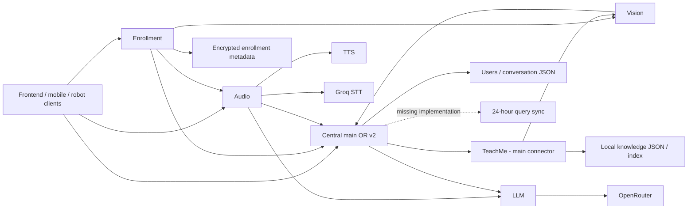

# NEXI Backend Engineering Audit

## 1. Executive Summary
**NOT READY - overall engineering score 2.3/10.** The seven historical services remain in source, but the concurrent run reached liveness for only Vision and Enrollment. Central, Audio, TeachMe and LLM have missing application imports; TTS lacks model weights in this environment. Vision reports healthy despite failed face-model loading. Alternative Central v2 starts but exposes a different API and does not restore the intended integration surface.

The most consequential defects are absent API authorization, incompatible service contracts, non-durable persistence paths, missing restricted-RAG enforcement, incomplete query-sync implementation and camera preemption that does not reliably release hardware. Several tests report success when services fail or do not exist. None of the 13 Sprint 2 requirements is fully verified as IMPLEMENTED.

This is a completed audit with explicit verification limits, not a repaired backend. All seven service startup attempts, a concurrent stack attempt, safe HTTP probes, selected tests and isolated contract checks are recorded below. Real biometric enrollment, speech interaction, model synthesis, cloud generation/sync, Docker deployment and load capacity remain UNVERIFIED where blocked. Production source was preserved; PROJECT.md is the only intentional repository edit from this audit. Existing changes and key/model artifacts were retained.

## 2. Audit Scope and Method
Evidence-based, read-only service-by-service review against the supplied S2-01 through S2-13 requirements. Only this report and temporary runtime logs may be created. Missing hardware, models, credentials or external services are environment blockers; mocked behavior is not production verification. Secret values and personal/biometric records are excluded.

| Phase | Status |
|---|---|
| Repository baseline | COMPLETE |
| Central | COMPLETE (runtime limitations recorded) |
| Audio | COMPLETE (startup blocked) |
| Vision | COMPLETE (degraded runtime) |
| TTS | COMPLETE (model unavailable) |
| TeachMe | COMPLETE (missing source) |
| Enrollment | COMPLETE (HTTP runs; workflow blocked) |
| LLM | COMPLETE (missing source; guards absent) |
| Shared/root | COMPLETE |
| Sprint 2 matrix | COMPLETE - all 13 assessed |
| Full runtime | COMPLETE - stack attempted; 2/7 reached liveness |
| E2E flows | COMPLETE assessment - blocked flows explicitly UNVERIFIED |
| Duplication | COMPLETE - static/reference analysis, no deletion |
| Security | COMPLETE defensive review - no exploit or advisory scan claim |
| Performance | COMPLETE static review - load capacity UNVERIFIED |
| Integration readiness | COMPLETE - NOT READY |
| Final report | COMPLETE |

Runtime observations were collected on 2026-09-07; report consolidation and unchanged-baseline checks completed on 2026-09-08. Relative evidence paths in sections 7-13 resolve against the named service unless prefixed with another repository directory. Runtime checks used the existing virtual environment; dependencies/models were not installed. Diagnostic DEBUG normalization applied only to child processes. No real user media or cloud-provider requests were submitted. An import-created empty test_data directory and temporary logs are runtime side effects; they are not application fixes.

## 3. Repository Baseline
- Root: `D:\Internship\Nexi\NEXI_Dev`; Windows PowerShell; audit date 2026-09-07.
- Branch: `refactoring`; HEAD `3bbbafd`, 2026-08-26T17:52:32+05:00, “Update README.md: comprehensive setup guide for laptop deployment”.
- Pre-existing changes: `requirements.txt` (one deletion); untracked `02_vision_service/yolov8n.pt`, `06_enrollment_service/06_enrollment_service/`. Preserve all.
- System and existing `venv/Scripts/python.exe`: Python 3.11.9.
- Git reports inability to read global ignore configuration; repository reads succeed.
- No applicable AGENTS.md found in repository or checked ancestor directories.

## 4. Actual Architecture
### Actual Architecture Discovered

The code contains seven HTTP services, common Python libraries, local file/SQLite storage, and multiple overlapping orchestration implementations. Cloud sync is an imported but absent class, not an eighth runnable service. Frontend/mobile/video calling implementations are outside this repository's demonstrated backend scope.

| Component | Actual entry point / port | Main dependencies and ownership | Evidence |
|---|---|---|---|
| Central | main:app / 8000; alternative api_v2:app | Main owns users/conversations and two resource managers; v2 owns a different enrollment/LLM surface | main.py:17,52-57; api_v2.py:141 |
| Vision | vision_service.app:app / 8001 | DeepFace, YOLO, physical camera; requests Central camera access | vision_service/services/camera_client.py:98-136 |
| Audio | main:app / 8002 | Microphone, wake-word, speaker encoder, Groq STT, SQLite command queue; calls LLM/TTS | main.py:97-132; conversation_orchestrator.py:218-274 |
| TTS | tts_service.app:app / 8003 | Piper workers/models and audio generation; multilingual internal routing remains | tts_service/app.py:119,217-240 |
| TeachMe | teachme_service.app:app / 8004 | Local knowledge JSON/vector index; Vision enrichment; missing services package | teachme_service/knowledge_base.py:23-25 |
| Enrollment | app.main:app / 8005 | Temporary media, encrypted local metadata; calls Audio/Vision/Central | app/services/enrollment_service.py:200-229 |
| LLM | main:app / 8006 | One intended OpenRouter provider; stateless generation route | main.py:20; llm_service/routes/generation.py:10-43 |
| Shared/root | Libraries and scripts, no single server | Multiple clients, circuit breakers, settings, rate limiters, CLI/test orchestration | shared/clients; config; nexctl.py; service/rag_orchestrator.py |



Arrows describe discovered intended calls, not successful end-to-end paths. Media, identifiers and response envelopes disagree across several arrows (sections 17 and 30). Network separation provides potential fault isolation, but shared imports, process-global state and inconsistent readiness make the current system tightly coupled in practice. A shared RAG helper is not evidence that the deployed generation route enforces RAG.

## 5. Directory Structure Assessment
Actual directory tree (directories through depth 3; environment, .git internals and Python caches elided; no data contents):

```text
  .dockerignore
  .env.example
  .gitignore
  COMMANDS.txt
  DEPLOYMENT.md
  PROJECT.md
  README.md
  cached_voice_player.py
  docker-compose.override.yml.example
  docker-compose.yml
  llm_context_builder.py
  nexctl.py
  pyrightconfig.json
  pytest.ini
  requirements.txt
  test_nexi_system_enhanced.py
.github/
  workflows/
01_central_server/
  01_central_server/
    data/
  clients/
  data/
  routes/
  services/
02_vision_service/
  tests/
  vision_service/
    routes/
    services/
    utils/
03_audio_service/
  03_audio_service/
    audio_service/
  audio_service/
    managers/
    models/
    routes/
    services/
    utils/
  stopword_model/
04_tts_service/
  models/
    urdu/
  tts_service/
05_teachme_service/
  teachme_service/
06_enrollment_service/
  06_enrollment_service/
    enrollment_data/
  app/
    clients/
    routes/
    services/
    storage/
    utils/
  tests/
07_llm_service/
  llm_service/
    routes/
    services/
config/
docker/
  scripts/
docs/
scripts/
service/
shared/
  clients/
  database/
  middleware/
  models/
  utils/
  validators/
tests/
  integration/
  performance/
tts_voice_cache/
voice_cache/
```

Dependency manifests: `requirements.txt`, `01_central_server/requirements.txt`, `02_vision_service/requirements.txt`, `04_tts_service/requirements.txt`, `05_teachme_service/requirements.txt`, `06_enrollment_service/requirements.txt`, `07_llm_service/requirements.txt`. No lockfile/pyproject found.

Inventory: 286 files outside environments/caches; 60168 Python source lines. AST syntax failures: [].

## 6. Sprint 2 Requirement Matrix

| ID | Requirement | Status | Evidence | Runtime Verified | Issues |
|---|---|---|---|---|---|
| S2-01 | Restricted RAG plus approved basic commands; teach-first fallback | MISSING | LLM generation.py:10-43 has no retrieval/command/output gate; caller controls system_prompt | Isolated real router with fake provider accepts open-domain input and forwards output; live full path blocked | NEXI-023,024,016,022 |
| S2-02 | One online LLM; remove local fallback architecture | PARTIAL | openrouter_client.py:32 one cloud model; shared/quantized_llm.py:104,115 retains executable local loader without found consumers | No local loader found mounted; provider and fine-tuning path UNVERIFIED | NEXI-015,022,024 |
| S2-03 | Wake failure permits direct voice; about 10-second silence/manual end | BROKEN | wake_word_service.py:35,151-175 missing keyboard module/fake file; Audio config.py:323 timeout 120 s | Startup failure reproduced; hardware/direct-voice flow UNVERIFIED | NEXI-006,007 |
| S2-04 | Remove emotion/mood completely; retain recognition | CONFLICTING | Face inference no longer analyzes emotion, but Central api_v2.py:453,603, conversation mood schema and Vision health retain it; FER manifest remains | Degraded Vision runs; no real emotion/recognition inference test | NEXI-015,011 |
| S2-05 | Collect ordinary Q/A with identity/time/durability/sync state | PARTIAL | Central conversations_persistence.py and routes/conversations_routes.py; missing TeachMe history store app.py:244 | Schema/write paths reviewed; durable interaction round trip UNVERIFIED | NEXI-003,030 |
| S2-06 | Separate TeachMe and ordinary Q/A through storage/API/sync | PARTIAL | Separate knowledge/conversation stores intended; v2 keeps turns in users; sync implementation absent | Cloud exclusion and full data flow UNVERIFIED | NEXI-030,001,016 |
| S2-07 | TeachMe gets resources; other heavy work yields | PARTIAL | hardware_resource_manager.py:305-322 logical revoke only; Vision resource_pool.py:78-97 retains camera | Logical priority works; independent managers double-grant; physical preemption UNVERIFIED | NEXI-005 |
| S2-08 | Remove redundant/obsolete code without regressions | PARTIAL | Multiple active/alternate apps, clients, prompts and loaders; sections 24-26 | AST/reference comparison complete; no deletion performed | NEXI-002,015,026,027,031 |
| S2-09 | Online-only; remove offline functionality | CONFLICTING | Audio main.py:97-132 wires command backlog; unreferenced local LLM loader and inactive Vision queue remain | Startup blocks Audio backlog; current LLM app has no discovered local-loader call | NEXI-015 |
| S2-10 | Jenny only exposed/usable | PARTIAL | TTS app.py:113-127,217-232 public Jenny allowlist; internal cache/speaker maps retain Ryan/Shahid | Public resolver verified in source; synthesis and alternate-voice HTTP behavior UNVERIFIED | NEXI-014,015 |
| S2-11 | English input/output only | CONFLICTING | Audio config.py:146 en/ur; TTS app.py:483-496 accepts Urdu; LLM language unconstrained | Isolated LLM route accepts language=ur; real STT/TTS blocked | NEXI-015,023 |
| S2-12 | Video call priority, release/reacquire and integration hooks | PARTIAL | Generic camera/resource routes but no verified call lifecycle; Vision camera.py:38,60 | Pause/resume 500; v2 resource/camera routes 404; actual video integration UNVERIFIED | NEXI-005,009,002 |
| S2-13 | Ordinary Q/A cloud sync every 24 hours; TeachMe local | BROKEN | Central main.py:17,21,25-28,68 missing sync class, external hard-coded history path, unsupervised loop | Main fails before scheduler; retry/idempotency/cloud boundary UNVERIFIED | NEXI-001,030 |

No requirement earns IMPLEMENTED from file presence alone. Local face/speech models are distinguished from offline LLM fallback: online-only product operation does not by itself settle whether local perception/Piper should be replaced. The approved scope for those local capabilities needs a product decision; the residual offline LLM and command-backlog code are independently documented.

## 7. Central Service Audit
### Service: Central / Orchestrator
Purpose: user/conversation persistence, proxy APIs and hardware coordination. Entry points: documented `main:app` (README.md:74), alternative `api_v2:app` (api_v2.py:141). Port 8000. Dependencies: FastAPI, aiohttp/httpx, shared helpers, Enrollment orchestrator (v2). Called by Audio, Enrollment, Vision camera client and external clients. Calls: TeachMe in main; Audio/Vision/LLM in v2. Data: local users, conversations and embedding cache. Resources: two independent in-memory camera allocation implementations. S2 responsibilities: query collection/separation, coordination, cloud sync, API orchestration.

#### Static analysis
- **NEXI-001 BLOCKER:** `main.py:17` imports absent `services.cloud_sync_service`. Runtime reproduces ModuleNotFoundError. No credential or hardware dependency is responsible.
- **NEXI-002 HIGH:** alternative v2 starts, but exports neither main's TeachMe/camera/resources routes nor its conversation-storage route. `main.py:52-57`, `api_v2.py:141` and live OpenAPI establish conflicting application surfaces. Standalone `routes/llm_routes.py:38` factory has no repository call site.
- `service_config.py:44-50` supplies hard-coded localhost URLs despite separate environment-aware shared configuration. `main.py:91` hard-codes port.
- **NEXI-003 HIGH:** `routes/user_routes.py:59-69` swallows persistence errors and does not inspect `save_users`' boolean result; requests can acknowledge non-durable data. Conversation writer uses shared mutable cache and a fixed temporary filename without locking the entire update (`conversations_persistence.py:118-160,198-222`).
- Exception handling often returns raw `str(e)`. Large alternate app mixes enrollment, caches, LLM and transport. v2 retains emotion context (`api_v2.py:453,603`).

#### Runtime analysis
Command: existing venv, `python -B -m uvicorn main:app --host 127.0.0.1 --port 8000`, cwd Central, root on PYTHONPATH. Startup failed after 2.66 s; launcher PID 18476, exit 1; no health listener.
Alternative: `api_v2:app`, same cwd/port; launcher PID 8348, Uvicorn PID 4852; health 200 after 4.50 s, OpenAPI 200; graceful shutdown completed, exit 0.
Warnings: Audio unavailable; logging formatter emitted internal errors (trace-field issue, NEXI-028). Health still says healthy.
Logs: temporary `nexi-audit-central-main.log` and `nexi-audit-central-v2.log`. The shutdown cache saver skips empty caches (`api_v2.py:169-173`); no embedding-cache file was created in these empty-data probes.

#### API contract
Main: `/users/*`, `/users/{user_id}/conversations`, `/conversations/{conversation_id}`, `/admin/stats`, `/teachme/*`, `/camera/*`, `/resources/*`. Main OpenAPI unavailable because startup fails.
Live v2 OpenAPI: POST `/users/register`, GET `/users/list`, POST `/users/verify`, GET `/users/verify/status`, GET `/health`, GET `/status`, POST `/llm/generate-response`, GET/DELETE `/llm/conversation`, GET `/llm/health`, GET `/`.
Main mixes JSON, query parameters and multipart; v2 generation uses form inputs. Error envelopes vary (HTTPException detail vs APIResponse vs success boolean). TeachMe connector: 15 s timeout, retry/backoff/circuit breaker (`teachme_connector.py:106-108,349-440`); v2 LLM timeout 150 s (`api_v2.py:109`). No general idempotency key. Frontend/mobile must choose an authoritative app before relying on routes.

#### Tests
No dedicated Central test module discovered. Ran actual startup/health/OpenAPI checks above. In-process real manager checks: logical priority preemption succeeds, but **both independent managers can grant the same camera**, and cancelling a queued lease fails while retaining its request. These checks do not exercise actual hardware or constitute end-to-end tests. Missing: durable writes under concurrency, authorization, mounted route contracts, cloud sync and camera release acknowledgements.

#### Security
**NEXI-004 CRITICAL:** main user/conversation/resource endpoints lack authentication/ownership dependencies (`routes/user_routes.py:77,113`, `routes/conversations_routes.py:30,189,230`, `resource_routes.py:25,86`). v2 OpenAPI also has no security scheme; verify routes are biometric functionality, not global API access control. Main CORS permits every origin with credentials (`main.py:40-43`); rate limiting exists but does not authorize callers. TLS is absent from these entry points. Main's user list describes returning embeddings. Upload limits, account ownership and sensitive error/logging behavior require remediation; no production safety claim.

#### Scalability/performance
Blocking JSON persistence inside async routes; process-local locks/caches do not coordinate workers. Full-document writes/read-modify-write risk lost updates. No measured throughput or RAM ceiling. aiohttp reuse and circuit breakers exist but do not compensate for broken startup/contracts. **NEXI-005 HIGH:** camera managers have independent ownership, and hardware preemption changes metadata without an owner stop/acknowledgement callback (`hardware_resource_manager.py:305-322`, `camera_manager.py:29`). Queued release cannot cancel pending work (`hardware_resource_manager.py:219-255`). Queue/history/lease lifetime needs bounds.

#### Sprint 2 compliance
S2-05 PARTIAL (conversation schema, timestamps, user ID and 500-record retention, no sync state/idempotency); S2-06 PARTIAL (separate conversation file exists; v2 stores turns in user records); S2-07 PARTIAL (logical leases only); S2-04 CONFLICTING (mood persistence and v2 emotion payloads); S2-11 CONFLICTING (unrestricted language string); S2-12 PARTIAL (generic leases but no call lifecycle); S2-13 BROKEN (missing imported implementation; `main.py:21,25-28,68` has hard-coded external history path, unsupervised daily task, no visible retry).

#### Cleanup candidates
| File | Reason/evidence | Removal confidence |
|---|---|---|
| `routes/llm_routes.py` | Factory unreferenced; overlaps v2 | LIKELY SAFE - VERIFY FIRST (external imports unknown) |
| `routes/teachme_routes.py` | main mounts sibling `teachme_routes.py`, different contracts | LIKELY SAFE - VERIFY FIRST |
| `camera_manager.py`, `hardware_resource_manager.py` | Both mounted by main | DO NOT REMOVE without migration |
| Nested `01_central_server/01_central_server/data` | Duplicate data layout; provenance/recovery value not established by source references | UNKNOWN |

#### Bugs/issues
NEXI-001 startup BLOCKER; NEXI-002 competing application contracts HIGH; NEXI-003 persistence reliability HIGH; NEXI-004 missing API access control CRITICAL; NEXI-005 inconsistent hardware ownership HIGH. Section 30 consolidates remediation under these stable IDs.

#### Service score
Correctness 2/10; reliability 2/10; maintainability 3/10; security 1/10; scalability 2/10; readability 5/10; testability 3/10; integration readiness 2/10. Scores reflect reproducible startup/contract failures and unprotected data APIs, not measured capacity.
#### Verdict
**NOT READY.** Alternative v2 liveness is verified; the documented application and main integration surface are broken.

## 8. Audio Service Audit
### Service: Audio
Purpose: microphone recording, wake/stop word, Resemblyzer verification, Groq STT, conversation orchestration and SQLite command backlog.
Entry: `03_audio_service/main.py`, `main:app`; port 8002. Dependencies: root requirements (no Audio requirements.txt), sounddevice/PyAudio, Porcupine, webrtcvad, Resemblyzer/Torch, Groq, aiohttp, SQLite. Called by Central, Enrollment and external clients; calls itself for STT and LLM/TTS/Central. Owns recordings, speaker embeddings and command queue; microphone/playback/VAD resources.
#### Static analysis
**NEXI-006 BLOCKER:** unconditional import of absent `audio_service.services.keyboard_wake_word` (`services/wake_word_service.py:35`), reached by main's advanced routes. Intended failure fallback is keyboard-only and passes a fabricated `KeyboardTrigger.wav` path (`wake_word_service.py:151-175`); no verified direct voice fallback. Default conversation timeout is 120 s (`config.py:323`), recording silence threshold 500 ms (`config.py:311`); neither proves a ten-second session silence requirement.
`api.py:26` uses relative import without an Audio package initializer; it is a separate legacy embedding API, not mounted by main. It constructs VoiceEncoder per request (`api.py:118`), unlike lazy singleton speaker handling (`routes/advanced_routes.py:59`).
#### Runtime analysis
Existing venv `python -B -m uvicorn main:app --host 127.0.0.1 --port 8002`, cwd Audio. Baseline launcher PID 20316, 1.33 s, exit 1: shared Settings rejects an inherited non-boolean DEBUG setting (ENVIRONMENT BLOCKER, NEXI-007). No .env edit performed.
Diagnostic retry with child-process-only `DEBUG=false`: PID 17548, 3.95 s, exit 1, ModuleNotFoundError for keyboard_wake_word (CODE DEFECT). Health/OpenAPI unavailable; no hardware accessed. Both processes exited; logs `nexi-audit-audio*.log`.
#### API contract
Mounted route families: `/api/v1/record`, audio listing/deletion; wake-word start/stop/status/detect; enroll/verify speaker; transcribe; conversation start/end/turn, record-until-silence, interrupt-playback, state/status; root queue management.
**NEXI-008 HIGH:** orchestrator posts raw octet-stream bytes to `/api/v1/transcribe` (`services/conversation_orchestrator.py:218-238`), while endpoint requires a multipart `UploadFile` (`routes/advanced_routes.py:1124`). Invalid media contract prevents the normal turn pipeline. Request schema exposes arbitrary server-side `audio_file_path`, language and speaker_id (`routes/orchestration_routes.py:24-29`). No shared error envelope. HTTP retries exist and can repeat side effects; no idempotency key. Live frontend compatibility UNVERIFIED.
#### Tests
`03_audio_service/test.py` is an interactive, hardware/data-writing diagnostic, outside pytest's test filename convention; not blindly executed against personal data. Startup probes failed as above; successful transcription, speaker verification, wake-word normal/failure, silence termination and multi-turn runtime are UNVERIFIED. No isolated automatic Audio regression suite discovered.
#### Security
No global authentication or per-user authorization in main/routers; wildcard credentialed CORS (`main.py:302`); rate limiter mounted. Server path inputs and unrestricted recording/listing/deletion APIs require access control and containment. Groq credentials are environment-sourced (values withheld). Full audio upload memory reads and blocking recording expose denial-of-service risk; TLS depends on external deployment. Transcription/user content is logged; privacy controls not established.
#### Scalability/performance
Synchronous recording/STT/file reads inside async paths; expensive speaker initialization is lazy in main but not the alternate API. Conversation state and hardware are process-global. SQLite backlog/retries exist, but do not implement a 24-hour ordinary Q/A dataset. Queued commands are runtime-wired in `main.py:97-132`; claims of removed offline behavior are false.
#### Sprint 2 compliance
S2-03 BROKEN; S2-09 CONFLICTING (active-wired offline command backlog); S2-11 CONFLICTING (`config.py:146` en/ur and STT auto-detection, `stt_service.py:148-167`); S2-10 PARTIAL at caller (arbitrary speaker ID). S2-07/S2-12 coordination UNVERIFIED at runtime.
#### Cleanup candidates
| File | Reason/evidence | Removal confidence |
|---|---|---|
| `api.py`, `embedding_extractor.py` | Alternate embedding path; compare consumers before retiring | LIKELY SAFE - VERIFY FIRST |
| `audio_service/managers/conversation_state_manager.py` vs `services/conversation_state.py` | Multiple state implementations; main imports services version | LIKELY SAFE - VERIFY FIRST |
| Queue modules | Main imports/starts them | DO NOT REMOVE without explicit feature migration |
| Stop-word .ppn | Active feature configuration; platform-specific artifact | DO NOT REMOVE |
#### Bugs/issues
NEXI-006 missing fallback module BLOCKER; NEXI-007 environment DEBUG validation MEDIUM; NEXI-008 orchestration media contract HIGH; NEXI-004 access control CRITICAL (shared root cause).
#### Service score
Correctness 1/10; reliability 2/10; maintainability 3/10; security 1/10; scalability 2/10; readability 5/10; testability 2/10; integration readiness 1/10.
#### Verdict
**NOT READY.** Baseline environment issue and independent missing-source defect are separately established.

## 9. Vision Service Audit
### Service: Vision
Purpose: DeepFace face detection/embeddings, YOLO object detection, MJPEG stream and camera control. Entry: `vision_service.app:app` via `main.py:24-42`; port 8001. Dependencies: FastAPI, OpenCV, DeepFace/TensorFlow/Keras, Torch/Ultralytics. Called by Central, TeachMe, Enrollment and clients. Calls Central's legacy `/camera/*`. Owns camera handle/model memory and optional queue code, no audited personal persistent store.
#### Static analysis
Face inference no longer calls emotion analysis (`services/face_detector.py:76-132`); face response model omits emotion. However live health/root/streaming presentation and old tests retain emotion fields/claims (`routes/health.py:38,59-65`, `models.py:66,72`). Do not remove DeepFace: face recognition actively depends on it.
**NEXI-005 HIGH (additional evidence):** camera client eventually grants access even after explicit Central denial (`services/camera_client.py:98-136`), caches availability without a TTL refresh, and pool's normal release relinquishes logical ownership but retains the open VideoCapture (`resource_pool.py:78-97`). Video-call priority is not enforced.
**NEXI-013 HIGH:** failed face embedding extraction returns a 128-zero vector as otherwise normal face data (`face_detector.py:110-132`); no validity flag. Downstream biometric integrity is at risk; recognition accuracy not measured.
#### Runtime analysis
Existing venv, `python -B -m uvicorn vision_service.app:app --host 127.0.0.1 --port 8001`, cwd Vision; child DEBUG normalized without editing .env. Initial launcher PID 18004/Uvicorn 16912; health 200 after 20.98 s. Repeat launcher 16420/Uvicorn 20724; 23.64 s. Both graceful exit 0.
**NEXI-011 HIGH ENVIRONMENT/DEPENDENCY BLOCKER:** DeepFace import requires tf-keras with installed TensorFlow 2.20.0; model load failed. YOLO loaded from existing model. No model installation attempted.
**NEXI-010 HIGH:** `/health` still reports healthy and camera available; code explicitly assumes availability (`routes/health.py:58-65`). Thus liveness passes; face readiness does not.
Live OpenAPI 200; missing upload yields expected 422. **NEXI-009 HIGH:** POST `/camera/pause` and `/camera/resume` each return 500 because `CameraStateResponse.message` is required but omitted (`models.py:48-50`, `routes/camera.py:38,60`). State changes before error response.
Logs: temporary `nexi-audit-vision.log`, `nexi-audit-vision-contract.log`.
#### API contract
Live routes: GET `/`, `/health`, `/api/face-data` (placeholder zero count), `/stream`, `/live`; POST `/api/v1/detect/faces`, `/api/v1/detect/faces/upload`, `/api/v1/analyze/complete`, `/camera/pause`, `/camera/resume`.
Multipart file upload; model/backend query allowlists. Exceptions sometimes become HTTP 200 with status=error/unavailable (`routes/detection.py:105-119`). Camera HTTP retries are blocking. No request idempotency; no authenticated resource ownership. Old tests and queue processor use missing unprefixed detection paths (`tests/test_vision.py:42,61`, `services/queue_processor.py:263`).
#### Tests
Discovered five functions in `tests/test_vision.py`. Executed health, camera-controls and live-UI with pytest: **3 nominal passed, exit 0, 6.38 s**, but camera test printed failure and returned False. **NEXI-012 HIGH:** tests do not assert success (`test_vision.py:89-117`); this is reproducible false-positive test reporting. Remaining face/emotion tests not executed against real biometrics: dependency blocked and paths stale. No successful face recognition or physical camera transfer claim.
#### Security
No OpenAPI security schemes/global auth; credentialed wildcard CORS (`app.py:144-148`), rate limiter exists. Camera feeds/controls and biometric output need authorization. Upload read/decode is memory-consuming; exceptions expose implementation details. Models must be trusted/provisioned; artifact integrity and dependency vulnerability status UNVERIFIED.
#### Scalability/performance
Synchronous model loading with retry sleeps inside async lifespan. Nominal lazy YOLO is eagerly triggered by startup availability check (`app.py:95-100`). Models stay resident; no TeachMe unload/preemption. Stream owns a long-lived camera context; pause skips processing while retaining ownership. Thread locks coordinate one process only; no throughput/GPU/RAM benchmarks performed.
#### Sprint 2 compliance
S2-04 PARTIAL locally, CONFLICTING repository-wide; S2-07 PARTIAL; S2-12 BROKEN camera-control contract and unsafe fallback. S2-09 offline queue modules present but not initialized by current Vision app (inactive; verify external consumers before deletion).
#### Cleanup candidates
| File | Reason/evidence | Removal confidence |
|---|---|---|
| Vision queue modules | No initialization in current app; stale unprefixed endpoint | LIKELY SAFE - VERIFY FIRST |
| Emotion-only tests/UI claims | Contradict removed inference | LIKELY SAFE - VERIFY FIRST; retain face assertions when replacing tests |
| `yolov8n.pt` | Runtime YOLO availability verified; pre-existing untracked model | DO NOT REMOVE |
| DeepFace/TF dependencies | Active face inference | DO NOT REMOVE |
#### Bugs/issues
NEXI-005 camera ownership HIGH; NEXI-009 pause/resume schema HIGH; NEXI-010 false readiness HIGH; NEXI-011 model environment HIGH; NEXI-012 misleading tests HIGH; NEXI-013 zero fallback embeddings HIGH.
#### Service score
Correctness 3/10; reliability 2/10; maintainability 4/10; security 1/10; scalability 2/10; readability 6/10; testability 2/10; integration readiness 2/10.
#### Verdict
**NOT READY.** HTTP startup/validation and clean stop work; camera contract and face capability do not.

## 10. TTS Service Audit
### Service: TTS
Purpose: local Piper/ONNX synthesis, voice selection, queue/workers and diagnostics. Entry: `tts_service.app:app` (`main.py:26`); port 8003. Dependencies: Piper, ONNX runtime, FastAPI, Prometheus, internal cache/engine/language/speaker managers; root and service requirement pins disagree. Called by Audio, Central, nexctl and voice-cache utilities. Owns voice model files, per-worker model caches, preferences/error metrics; CPU/RAM/output audio.
#### Static analysis
Main public `VOICE_DEFINITIONS` now contains only Jenny (`app.py:113-127`), and `resolve_voice` validates against that registry (`app.py:217-232`). However active worker EngineManager and unified cache still implement Urdu and Ryan/Shahid (`parallel_worker_pool.py:119`, `engine_manager.py:104-125,154,211`, `unified_model_cache.py:39-58`); speaker status configuration still exposes three voices. `/speakers/switch` validates via resolve_voice, so alternate voice synthesis through that endpoint is **not demonstrated**. Legacy/internal mappings must not be confused with a proven public allowlist bypass.
#### Runtime analysis
Existing venv, `python -B -m uvicorn tts_service.app:app --host 127.0.0.1 --port 8003`, cwd TTS. Launcher PID 19672; 2.62 s; exit 3. **NEXI-014 HIGH ENVIRONMENT BLOCKER:** `RuntimeError: No Piper models found!` at `app.py:203,274`. Local model directory has five .onnx.json metadata files and **no .onnx weights**. No voice download/install attempted. Planned HTTP voice/synthesis checks could not run; health unavailable; process exited. Log `nexi-audit-tts.log`.
#### API contract
GET /health, /health/detailed, /voices, /cache/status, /speakers/status, /speakers/state/{speaker_id}, /speakers/stats, /metrics, /metrics/json, /errors*, /diagnostics; POST /speak, /config/set_voice, /speakers/switch (`app.py:356-1000`). JSON SpeechRequest: text 1..MAX_TEXT_LENGTH, optional voice_id and language, extra keys silently ignored (`app.py:240-244`). /speak returns WAV bytes, not JSON audio path. Empty whitespace rejected; explicit language accepts en/english/ur/urdu (`app.py:483-496`).
Timeout includes queue plus synthesis; work delegated to threads via asyncio.to_thread, bounded queue in worker pool. Cancellation of actual ONNX inference is not established. Voice settings unnecessarily reuse a required-text synthesis schema. HTTP error handlers add request ID; body schemas differ from other services. Live OpenAPI/synthesis UNVERIFIED due missing weights.
#### Tests
No service-local automated tests discovered. Actual startup failed; Jenny audio, alternate voice HTTP rejection and language behavior remain UNVERIFIED at deployed runtime. Static request/route paths demonstrate Urdu is accepted rather than rejected.
#### Security
Wildcard credentialed CORS and rate limit middleware; no global auth/ownership. Text length bounds exist; diagnostics/error APIs can disclose internal paths/error details. Model files locally provisioned, integrity verification absent from this service. No user data/secret values read for report.
#### Scalability/performance
Three workers have independent caches; Jenny is eagerly loaded in first cache during startup (`app.py:279-295`). Model duplication can increase resident RAM. Cache eviction exists; no Central resource lease integration or TeachMe-wide unload hook found. Claims of 3x throughput in comments are unbenchmarked.
#### Sprint 2 compliance
S2-10 PARTIAL (public Jenny registry, residual active multi-voice internals/status, missing runtime weights); S2-11 CONFLICTING (Urdu input/language detection active); S2-09 CONFLICTING under literal online-only scope (local TTS inference remains active design; distinguish from offline LLM). Whether local perception/TTS is intended to remain under online-only product operation needs requirement-owner interpretation.
#### Cleanup candidates
| File | Reason/evidence | Removal confidence |
|---|---|---|
| Ryan/Shahid configs and old preferences | Referenced by active internal maps; not safe to delete first | LIKELY SAFE - VERIFY FIRST after mapping removal |
| Lessac/LibriTTS metadata | No current public registry entry or named TTS source reference found; dynamic model-directory loading still needs verification | LIKELY SAFE - VERIFY FIRST |
| Engine/language/cache managers | Imported by live workers | DO NOT REMOVE without migration |
| Jenny metadata | Required partner of missing weight file | DO NOT REMOVE |
#### Bugs/issues
NEXI-014 missing model environment HIGH; NEXI-015 Sprint-1 policy remnants HIGH (multi-language/voice/local behavior consolidated later); NEXI-004 API access control CRITICAL.
#### Service score
Correctness 3/10; reliability 3/10; maintainability 4/10; security 2/10; scalability 3/10; readability 6/10; testability 3/10; integration readiness 2/10.
#### Verdict
**UNVERIFIED for synthesis; NOT READY for integration.** Missing artifact is an environment blocker, not evidence Piper's inference code itself is broken.

## 11. TeachMe Service Audit
### Service: TeachMe
Purpose: teach/store/search local facts and objects with Vision enrichment and vector search. Entry `teachme_service.app:app`, `main.py:25`; port 8004. Dependencies: FastAPI, NumPy, optional FAISS/aiofiles, aiohttp/requests, optional PyJWT, file locks. Called by Central and external clients; calls Vision. Data: `knowledge_data.json`, backups, in-memory/index data; proposed history store is absent. Heavy-resource priority is not wired to Central leases.
#### Static analysis
**NEXI-016 BLOCKER:** absent package `teachme_service/services`; required imports: embedding_client, dedup_checker, confidence_gate (`knowledge_base.py:23-25`), query_history_store/query_rotation_policy (`app.py:244-245`). No inferred implementations credited.
**NEXI-017 HIGH:** live-source contract disagrees with Central: TeachMe accepts POST `/learn` with typed object/fact data, while Central sends POST `/knowledge/learn` with name/category/128-D embedding (`01_central_server/teachme_connector.py:184-191`). Embedding search accepts query object name in query parameters (`app.py:666-675`), not Central's vector JSON.
**NEXI-018 HIGH:** `object_processor.py:488-553` constructs deterministic MD5/text-derived feature vectors, not demonstrated semantic embeddings. Proposed EmbeddingClient is instantiated but missing, and existing learn methods accept supplied vectors without invoking dedup/confidence clients. Central expects 128-D while TeachMe config/index uses 768-D (`config.py:67`).
#### Runtime analysis
Existing venv `python -B -m uvicorn teachme_service.app:app --host 127.0.0.1 --port 8004`, cwd TeachMe, child DEBUG=false. PID 14808; failed after 2.64 s; exit 1; ModuleNotFoundError at knowledge_base.py:23. No health/OpenAPI. Log `nexi-audit-teachme.log`; process exited. Missing optional FAISS/PyJWT would be environment issues, but absent application package is the first actual blocker.
#### API contract
Source: GET /health, /health/detailed, knowledge objects/facts/all/stats/search, related items, metrics; POST /auth/register, /auth/token, /auth/validate, /learn, /knowledge/search/embedding, /knowledge/search/advanced, /knowledge/learn-batch; DELETE /forget/{id}, /forget-by-name/{name}. Typed LearningRequest union is not discriminated by type; route assumes matching data type. Bounds exist on confidence, selected strings/search limits; batch/request attributes need total-size bounds.
Vision config uses `/analyze/complete` (`config.py:24`), missing Vision's /api/v1 prefix; same integration contract family as NEXI-017. Retry/circuit breaker connector exists; object processor also has direct HTTP paths. No request idempotency; UUID insertion is not duplicate prevention.
#### Tests
No dedicated automated TeachMe suite discovered. Startup failed; no actual teach/query/persistence/search round trip executed. Missing module classes, trained embedding behavior, query-history retention and cloud exclusion are UNVERIFIED.
#### Security
Auth utility code is present but learn/read/delete routes do not apply require_api_key/require_jwt or Depends. AUTH_ENABLED defaults true (`authentication.py:31`), but that flag does not protect undecorated routes. The optional require_jwt helper also bypasses checks when JWT support is unavailable (`authentication.py:279`). Registration is publicly callable. Secrets are environment/random fallback, not reported. Input character filtering does not supply authorization. **NEXI-019 MEDIUM:** rate-limit middleware returns an HTTPException object instead of a Response (`app.py:236`); threshold branch is invalid ASGI middleware behavior. Two auth implementations and duplicate rate limit mechanisms complicate enforcement.
#### Scalability/performance
Async save uses a fixed .tmp path without acquiring sync writer's lock (`knowledge_base.py:306-352`); overlapping await/write operations can race. This extends NEXI-003 persistence issue. Backups and computed objects/facts reduce some duplication but full JSON snapshots/index remain process-local. No workload preemption, CPU/GPU budget or model unloading for TeachMe found. FAISS has linear fallback; performance unmeasured.
#### Sprint 2 compliance
S2-01 BROKEN end-to-end (TeachMe unavailable); S2-05 PARTIAL schemas only for new history; S2-06 PARTIAL separate intended models/files but missing history implementation and cloud boundary; S2-07 MISSING service-wide prioritization; S2-13 BROKEN dependent history/sync path. No claim personal data stays local during cloud inference until actual LLM payload is audited.
#### Cleanup candidates
| File | Reason/evidence | Removal confidence |
|---|---|---|
| Authentication helpers | Present security intent, not enforced on data routes | DO NOT REMOVE; wire and consolidate |
| safe_file_lock.py | Sync persistence imports it | DO NOT REMOVE |
| Missing services references | Incomplete implementation, not deletion candidates | UNKNOWN; recover intended sources |
| Hash embedding path | Actively invoked by learn/search | DO NOT REMOVE without replacement/migration |
#### Bugs/issues
NEXI-016 startup BLOCKER; NEXI-017 incompatible learning/search/vision contracts HIGH; NEXI-018 retrieval/vector quality HIGH; NEXI-019 rate-limit response MEDIUM; shared NEXI-003 persistence HIGH and NEXI-004 access control CRITICAL.
#### Service score
Correctness 1/10; reliability 2/10; maintainability 3/10; security 1/10; scalability 2/10; readability 5/10; testability 2/10; integration readiness 1/10.
#### Verdict
**NOT READY.** Source tree is incomplete; object teaching/grounding are not currently executable.

## 12. Enrollment Service Audit
### Service: Enrollment
Purpose: five-photo/five-voice enrollment, improve/replace training, local encrypted record storage and Central registration. Entry `app.main:app` from service directory (README's instruction to cd into app and import app.main is inconsistent); port 8005. Dependencies: FastAPI, httpx, shared Audio client, cryptography/Fernet, aiofiles; calls Vision/Audio/Central. Owns enrollment metadata, temporary uploads, encryption key/fallback keys; remote inference resources.
#### Static analysis
Main mounts `app/services/enrollment_service.py`; enhanced implementation is not imported by router (`routes/enrollment.py:12,22`). StorageAdapter constructs both sync and async stores (`utils/storage_adapter.py:37-38`).
**NEXI-020 HIGH:** normal local enrollment record omits face/voice embeddings (`enrollment_service.py:212-226`) while startup recovery expects those fields (`enrollment_service.py:596-597`). Central holds biometric vectors but encrypted local record cannot restore them. Registration precedes local durable save (`enrollment_service.py:200-229`); failure/deletion has no cross-service rollback and deletion may still claim all-system success after local failure (`enrollment_service.py:701-714`).
**NEXI-021 HIGH:** Enrollment Vision client posts `/process-face` (`clients/vision_client.py:55`) absent from live Vision OpenAPI. Central client registration and startup sync rely on main's routes, absent from runnable Central v2. Even main's add_user response omits the user_id required by Enrollment (`01_central_server/routes/user_routes.py:77-106`; `clients/central_server_client.py:90-93`). Detailed Audio health treats ServiceCallResult as a dict (`clients/audio_client.py:205-218`).
#### Runtime analysis
Existing venv, `python -B -m uvicorn app.main:app --host 127.0.0.1 --port 8005`, cwd Enrollment; child DEBUG=false. Launcher PID 15444/Uvicorn 9088; health 200 after 3.98 s; OpenAPI 200; invalid enrollment body correctly 422. Detailed health exceeded 3 s probe budget while dependencies down. Log reproduces `'ServiceCallResult' object has no attribute 'get'` in Audio health adapter. Startup sync found zero local records, so no personal records transmitted. Graceful shutdown waited for in-flight health work then completed, exit 0. Log `nexi-audit-enrollment.log`.
#### API contract
Live /enrollment/check-user, /enroll, /improve-training/{user_id}, /update-model/{user_id}, /health-detailed, /storage/stats, /storage/list, /storage/{user_id} GET/DELETE, /delete-user/{user_name}, root and /health.
Enrollment multipart requires 5 photos + 5 audio samples, name, optional age/relation; service enforces validation but docs alone are not proof successful inference. update/improve sometimes interpret user_id as name (`enrollment_service.py:281,620`), unstable external identity contract. HTTP retries/circuit breaker in Central client; per-call httpx clients limit reuse. No request idempotency or documented recoverable transaction ID.
#### Tests
Mock service fixture exists (`tests/mock_services.py`) with random embeddings; it is not real recognition verification and not run as substitute production. Actual startup/OpenAPI/missing-input checks passed; enrollment and speaker verification UNVERIFIED because Audio/face inference/registration contracts are blocked. No dedicated assertion-based workflow suite discovered.
#### Security
Fernet encryption exists for local metadata (`utils/storage_async.py:58-64`), conditional on ENABLE_ENCRYPTION. This does not encrypt Central's biometric JSON or transient media. Key is a local file; chmod errors are ignored and fallback keys searched (`utils/encryption.py:24-47,142-164`); Windows ACL and rotation/recovery UNVERIFIED. Existing nested encryption key must be kept.
NEXI-004: no security schemes in live OpenAPI; unauthenticated storage retrieval/deletion and user enumeration. Path containment for user_id is not enforced in storage joins; remote exploitability not destructively tested. Upload size checked after full read, MIME trusted and original suffix reused (`file_handler.py:16-42`). Temporary raw media exists during processing; crash cleanup/retention unverified.
#### Scalability/performance
Ten samples processed sequentially; synchronous upload writes and encryption/JSON serialization remain in async workflow. Async storage writes directly to final file with no atomic replace/transaction lock (`storage_async.py:54-70`), extending NEXI-003. No confirmed per-user concurrent-operation guard on this service's workflow. Background sync task is unsupervised.
#### Sprint 2 compliance
Enrollment remains required for identity; face functionality must survive emotion cleanup. S2-04 has legacy context elsewhere but no new emotion inference here. S2-07/S2-12 no global priority/call preemption. S2-05/S2-06 ordinary query dataset is not owned by Enrollment.
#### Cleanup candidates
| File | Reason/evidence | Removal confidence |
|---|---|---|
| `enrollment_service_enhanced.py` | Not selected by current router; alternate orchestration implementation | LIKELY SAFE - VERIFY FIRST |
| `app/storage/enrollment_storage.py` | Alternative class, imports require repository-wide check | LIKELY SAFE - VERIFY FIRST |
| Sync/async stores and adapter | All currently imported; adapter constructs both | DO NOT REMOVE without migration |
| Nested directory containing encryption.key | Existing decryption/recovery material, not mere duplication | DO NOT REMOVE |
#### Bugs/issues
NEXI-020 recovery/transaction data integrity HIGH; NEXI-021 integration contracts HIGH; NEXI-003 persistence HIGH; NEXI-004 access control CRITICAL.
#### Service score
Correctness 3/10; reliability 3/10; maintainability 4/10; security 2/10; scalability 2/10; readability 5/10; testability 3/10; integration readiness 2/10.
#### Verdict
**NOT READY for enrollment integration.** HTTP app runs; real enrollment/recovery is not verified and contracts contain demonstrated defects.

## 13. LLM Service Audit
### Service: LLM
Purpose: online chat generation through one OpenRouter model. Entry `main:app`, port 8006. Dependencies FastAPI, requests, dotenv; called by Audio, Central shared client, nexctl and diagnostics. Calls OpenRouter HTTPS. No owned persistent query/history dataset; request/response data sent to external provider.
#### Static analysis
**NEXI-022 BLOCKER:** `main.py:20` imports missing `llm_service.routes.format`; lifespan also registers its factory (`main.py:49`).
**NEXI-023 HIGH Sprint blocker:** no restricted-RAG input or output gate in `routes/generation.py:10-43`. Caller can supply system_prompt; knowledge_items/history from Central are not schema fields and are discarded. Output is forwarded unfiltered. No approved 10-15-command allowlist discovered on generation paths. Unreferenced legacy `system_prompts.py:160-176` explicitly encourages general knowledge when no match exists; not the current route's enforcement.
**NEXI-024 HIGH:** shared LLM client calls nonexistent CircuitBreaker.is_closed outside its generation try block (`shared/clients/llm_client.py:106`), also breaking status (`:269`); the AttributeError was reproduced through Central v2. It additionally expects result.data.response (`:158-160`) while the route returns top-level text/metadata (`generation.py:34-38`). Later caught failures can report canned fallback as success (`llm_client.py:207-216`), obscuring generation failures. Audio sends text, but route requires query (`conversation_orchestrator.py:263-274`).
One actual cloud model is configured (`openrouter_client.py:32`); no local-loader invocation in current LLM app. Offline fallback log messages are stale: client returns failure, not local inference. `shared/quantized_llm.py` still has executable transformers loading but no found repository consumer; quick_start.py retains SmolLM environment setup.
#### Runtime analysis
Existing venv `python -B -m uvicorn main:app --host 127.0.0.1 --port 8006`, cwd LLM; PID 18096, 1.33 s, exit 1; missing format module. No deployed generation/health. Intended health path is /api/v1/health, not /health used by several root probes. Log `nexi-audit-llm.log`. No external provider call made; provider model availability/credential validity UNVERIFIED.
#### API contract
Source routes /api/v1/generate POST, /api/v1/health GET; /api/v1/format missing implementation. query min length 1 but no max; max_tokens/temperature accept out-of-range values and language is unconstrained/unused. /generate returns success,text,metadata; raw provider errors may become HTTP 500 detail. OpenRouter synchronous requests.post inside async generate blocks event loop (`openrouter_client.py:97`), 30 s default timeout; no retry/circuit breaker in provider client. Provider health treats responses below 500 (including 401/429) as healthy (`openrouter_client.py:179`).
#### Tests
Executed all three service pytest tests: **3 nominal passed in 11.85 s, exit 0**, with no LLM server running. They catch connection failures/return early; extend NEXI-012 false-positive coverage.
Also ran isolated real GenerationRequest/router through TestClient with a recording fake provider: arbitrary open-domain query + caller system prompt accepted (200), Urdu language accepted, supplied knowledge discarded, synthetic provider output returned unchanged, max_tokens=-1/temperature=99 accepted. These are **application contract/guardrail tests with a fake provider**, not proof of live model behavior or repaired startup.
#### Security
No authentication/authorization or rate limiter on this app; wildcard credentialed CORS. User-controlled system prompt, unlimited query size and unconstrained generation controls permit resource/cost abuse if deployed. API key name is case-sensitive `OpenRouter_API_Key`; values never reported. No explicit consent/redaction/data boundary for external inference. No output grounding/English validator.
#### Scalability/performance
Blocking HTTP in async route; no pooled Session; long external call serializes event-loop work. Routes registered in lifespan can duplicate across repeated lifespan runs. Single-provider deployment/fine-tuning artifact pipeline not demonstrated. Tokens_generated counts whitespace words rather than provider token usage (`openrouter_client.py:114`); latency is local elapsed only.
#### Sprint 2 compliance
S2-01 MISSING guards/BROKEN full path; S2-02 PARTIAL one active cloud model, stale local code and broken app; S2-04 CONFLICTING legacy prompts/context; S2-05 MISSING collection in direct generation; S2-09 PARTIAL local inference not mounted but remains present; S2-11 MISSING input/output English enforcement. S2-06 local-only knowledge cloud boundary not guaranteed.
#### Cleanup candidates
| File | Reason/evidence | Removal confidence |
|---|---|---|
| prompt_builder.py, system_prompts.py | No current app/client import found; legacy policy contradicts Sprint 2 | LIKELY SAFE - VERIFY FIRST |
| shared/quantized_llm.py | No discovered external-to-file import/call; actual offline loader remains | LIKELY SAFE - VERIFY FIRST |
| quick_start.py, old hybrid tests | Still launch/describe removed model setup; tests do not enforce failure | LIKELY SAFE - VERIFY FIRST (replace valid smoke coverage) |
| generation.py/OpenRouter client | Actual intended route/provider | DO NOT REMOVE |
#### Bugs/issues
NEXI-022 startup BLOCKER; NEXI-023 RAG policy HIGH; NEXI-024 client/response/fallback contract HIGH; NEXI-012 false-green tests HIGH; NEXI-004 exposed API CRITICAL.
#### Service score
Correctness 1/10; reliability 1/10; maintainability 3/10; security 1/10; scalability 1/10; readability 6/10; testability 3/10; integration readiness 1/10.
#### Verdict
**NOT READY.** Restoring the missing import alone would expose unrestricted generation, not a Sprint 2-compliant system.

## 14. Other/Shared Components

Shared code contains useful mechanisms but is not a coherent verified platform. `shared/clients/base_client.py` provides HTTP/circuit-breaker behavior, while `shared/utils/circuit_breaker.py` has a different interface. The LLM client calls an absent method (NEXI-024). `ServiceClientFactory.get_audio_client` passes an unsupported keyword (`shared/clients/service_factory.py:42`; AudioServiceClient constructor `audio_client.py:31-36`); an isolated call raised TypeError. `config/ports.py:82-91` omits llm from get_base_url, silently resolving it to Central; direct evaluation verified both URLs were equal (NEXI-026).

`shared/rate_limiter.py:280,309` raises HTTPException in middleware. An isolated real middleware test with a one-request limit returned [200, 500], not [200, 429] (NEXI-019). `shared/models/structured_logger.py:73-85` installs a trace_id formatter without ensuring every handler record has that field; live Central v2 emitted formatting errors (NEXI-028).

Root `service/rag_orchestrator.py`, `llm_context_builder.py` and the large interactive `test_nexi_system_enhanced.py` provide alternate orchestration, not demonstrated service-level policy enforcement. The context builder is used by that harness; absence of a deployment import matters. `nexctl.py` is operational tooling with stale route assumptions and interactive cleanup actions; destructive actions were not executed. `scripts/health_check_all.py` checks six services and omits LLM. Static TLS/JWT/load-balancer/transaction helpers do not establish deployed TLS, authorization, balancing or transactions.

Shared/root verdict: **NOT READY** for reliance without contract consolidation and assertion-based checks. No standalone cloud-sync service or working replacement for the missing scheduler class was discovered.

## 15. Runtime Service Results

Individual launches used `venv/Scripts/python.exe -B -m uvicorn MODULE --host 127.0.0.1 --port PORT`, with cwd at the service root and repository/service paths on PYTHONPATH. Windows venv launchers can have a separate server child PID. Seconds below measure readiness or observed exit, not throughput. Service-level details and log names appear in sections 7-13.

| Service / module | Port | Launcher / server PID | Seconds | Health / representative result | Exit / shutdown |
|---|---|---|---|---|---|
| Central main:app | 8000 | 18476 / no listener | 2.66 | Missing services.cloud_sync_service; CODE DEFECT | 1 |
| Central api_v2:app alternative | 8000 | 8348 / 4852 | 4.50 | /health and /openapi.json 200; incompatible surface | 0, graceful |
| Audio main:app baseline | 8002 | 20316 / no listener | 1.33 | Inherited invalid DEBUG; ENVIRONMENT BLOCKER | 1 |
| Audio main:app, DEBUG=false | 8002 | 17548 / no listener | 3.95 | Missing keyboard_wake_word; CODE DEFECT | 1 |
| Vision vision_service.app:app | 8001 | 18004 / 16912 | 20.98 | /health 200 despite failed DeepFace; ENVIRONMENT/READINESS defects | 0, graceful |
| Vision repeat | 8001 | 16420 / 20724 | 23.64 | /camera/pause and /camera/resume 500; missing upload 422 | 0, graceful |
| TTS tts_service.app:app | 8003 | 19672 / no ready listener | 2.62 | No Piper models found; ENVIRONMENT BLOCKER | 3 |
| TeachMe teachme_service.app:app | 8004 | 14808 / no listener | 2.64 | Missing teachme_service.services; CODE DEFECT | 1 |
| Enrollment app.main:app | 8005 | 15444 / 9088 | 3.98 | /health/OpenAPI 200; invalid enrollment 422; detailed probe >3 s | 0, graceful |
| LLM main:app | 8006 | 18096 / no listener | 1.33 | Missing llm_service.routes.format; CODE DEFECT | 1 |

The complete seven-service launch was then attempted concurrently, with DEBUG=false only in child environments:

| Service | Launcher PID | Ready | Readiness time | Final exit |
|---|---|---|---|---|
| Central main | 15120 | No, missing cloud sync import | n/a | 1 |
| Audio | 15844 | No, missing keyboard fallback import | n/a | 1 |
| Vision | 9960 | Liveness only; face model failed | 16.56 s | 0, graceful |
| TTS | 15880 | No, missing weights | n/a | 3 |
| TeachMe | 20036 | No, missing services package | n/a | 1 |
| Enrollment | 19036 | Liveness only; dependencies unavailable | 2.58 s | 0, graceful |
| LLM | 19764 | No, missing format route | n/a | 1 |

After main exited, alternative Central v2 was launched alongside the surviving services (PID 16120, ready 3.59 s, graceful exit 0). Cross-service HTTP evidence:

| Request | Observed | Meaning |
|---|---|---|
| GET 8000/resources/status; /camera/status | 404 / 404 | Runnable Central alternative lacks integration hooks |
| GET 8000/llm/health | 200 with error/degraded result; log AttributeError is_closed | Transport success does not mean LLM readiness |
| POST 8001/process-face; /analyze/complete | 404 / 404 | Enrollment and TeachMe caller URLs do not exist |
| POST 8001/api/v1/detect/faces/upload without file | 422 | Required upload validation works |
| POST 8005/enrollment/enroll without fields | 422 | Required enrollment fields enforced |
| POST 8004/knowledge/learn | Connection refused | TeachMe not listening; source also disagrees with path |
| POST 8006/api/v1/generate | Connection refused | LLM not listening |

All audit-launched service processes were stopped after probes. Logs were kept under the system temporary directory with the nexi-audit prefix. Docker was unavailable, so container runtime is UNVERIFIED. No inference latency, recognition accuracy, production availability or successful complete stack is claimed.

## 16. End-to-End Flow Validation

FAIL can reflect a reproduced component/contract failure that prevents the flow; it does not imply a live model interaction occurred. Isolated fake-provider checks are labeled. UNVERIFIED means the required real workflow could not be exercised without unavailable dependencies, hardware/models, personal-data writes or external service access.

| Flow | Expected | Actual | Result | Evidence |
|---|---|---|---|---|
| FLOW-01 | All required services start and are ready | 2/7 liveness; Vision face readiness failed | FAIL | Concurrent run, section 15 |
| FLOW-02 | Existing/new enrollment registers usable face/voice identity | Enrollment HTTP runs; Audio/face/Central contracts blocked; no real media submitted | UNVERIFIED | NEXI-006,011,020,021 |
| FLOW-03 | Verify known speaker reliably | Audio cannot import; no microphone or identity test | UNVERIFIED | Audio startup log, NEXI-006 |
| FLOW-04 | Working normal wake-word interaction | Audio cannot start; Porcupine/hardware path not reached | UNVERIFIED | NEXI-006 |
| FLOW-05 | Wake failure allows direct voice and silence/manual end | Missing keyboard fallback import; source fallback is keyboard/fake file, not direct voice | FAIL | wake_word_service.py:35,151-175; config.py:323 |
| FLOW-06 | Known TeachMe question yields grounded answer | TeachMe and LLM unavailable; knowledge dropped by LLM schema | UNVERIFIED | NEXI-016,022,023,024 |
| FLOW-07 | Unknown question requests teaching | Isolated real route has no unknown-knowledge gate and returns fake provider text unchanged; live workflow blocked | FAIL (guard contract) | generation.py:10-43; isolated TestClient |
| FLOW-08 | Open-domain request blocked | Isolated real route accepts arbitrary question/caller prompt and forwards synthetic provider output | FAIL (guard contract) | HTTP 200 in fake-provider test; no actual model call |
| FLOW-09 | Teach object stores usable knowledge | Missing services package and Vision path mismatch prevent execution | UNVERIFIED | NEXI-016,017,018 |
| FLOW-10 | TeachMe preempts other expensive work | Logical priority revoke passes; two managers can grant camera; no model-release cooperation | PARTIAL | Real manager checks, NEXI-005 |
| FLOW-11 | Multi-turn conversation completes and retains context | STT/LLM contracts and startup blocked | UNVERIFIED | NEXI-008,024 |
| FLOW-12 | English speech/query/response supported | English accepted by schemas; no speech-to-answer-to-Jenny round trip | PARTIAL | Audio/TTS/LLM schema review; fake-provider route only |
| FLOW-13 | Non-English input rejected | LLM language=ur accepted in isolation; STT/TTS source permits Urdu | FAIL | generation.py; TTS app.py:483-496; Audio config.py:146 |
| FLOW-14 | Only Jenny usable | Public resolver allows Jenny; internals retain other voices; weights missing | PARTIAL | TTS app.py:217-232; startup log |
| FLOW-15 | Emotion processing/context/data absent | Face emotion inference removed; mood/emotion context, schema, health and dependencies remain | FAIL | Central api_v2.py:453,603; Vision health.py; manifest FER |
| FLOW-16 | Offline LLM architecture absent | Current provider is online only; unreferenced executable local loader remains | PARTIAL | openrouter_client.py:32; shared/quantized_llm.py:104,115 |
| FLOW-17 | Ordinary Q/A durably persisted | Separate main route/schema exists; v2 stores user turns; no durable full-flow write verified | PARTIAL | conversations_persistence.py; NEXI-003,030 |
| FLOW-18 | TeachMe persisted separately | Distinct intended knowledge store; service/history unavailable; no teach/store/restart round trip | PARTIAL | knowledge_base.py:306-352; NEXI-016,030 |
| FLOW-19 | Q/A sync every 24 hours | Missing scheduler implementation prevents main startup | FAIL | Central main.py:17,25-28 |
| FLOW-20 | Cloud failure retains backlog and retries safely | No runnable sync worker; no failure injection/cloud request made | UNVERIFIED | NEXI-001,030 |
| FLOW-21 | Incoming call takes camera, pauses activity and recovers | Pause/resume each 500; v2 hooks absent; metadata leases cannot ensure physical release | FAIL (backend hooks) | HTTP probes; NEXI-002,005,009 |
| FLOW-22 | Clean shutdown/restart without lost state/resources | Running Vision/Enrollment/v2 stopped cleanly; Vision repeated; blocked apps and durable recovery not verified | PARTIAL | Section 15 exit records; NEXI-020 |

## 17. API / Frontend / Mobile Integration Readiness

### Integration Contract Status

**NOT READY.** Clients cannot safely implement one consistent backend contract from the current documents and servers.

| Boundary | Actual mismatch / status | Required contract decision |
|---|---|---|
| Public Central | main and v2 mount different routes, formats and stores | Select one authoritative app and publish its versioned contract |
| Enrollment -> Vision | /process-face vs /api/v1/detect/faces[/upload]; expected face_detected/embedding vs faces array | Define media encoding and typed face-result adapter |
| Enrollment -> Central | /users/data/add_user absent in v2; main response omits required user_id | Stable user ID, registration result and duplicate/retry behavior |
| Central -> TeachMe | /knowledge/learn flat payload vs /learn typed union; 128 vs 768 dimensions | One learning/search contract with embedding model/version |
| TeachMe -> Vision | /analyze/complete missing /api/v1 | Update consumer/provider together |
| Audio -> STT | Raw octet-stream sent to multipart endpoint | Explicit multipart field/content type or a documented raw endpoint |
| Audio/shared -> LLM | text vs query; nested response vs top-level text; missing breaker method | Shared schema and error semantics; preserve knowledge explicitly |
| TTS | WAV response; Jenny public resolver; language policy conflicts | Declare media type, voice policy, size and timeout limits |
| Health/readiness | /health vs /api/v1/health; 200 despite unavailable capability | Separate liveness from dependency/model readiness |
| Video team | Generic leases, broken camera controls, no agreed call events | Lease/revoke/ack/reacquire plus call state and snapshot interface |

`docs/openapi.yaml` advertises routes not present in live apps, including /api/v1/query, /api/v1/enroll, /api/v1/llm/generate and /api/v1/tts/synthesize. Its language enum also includes unsupported Sprint 2 languages. Live OpenAPI is a better inventory for runnable apps, but cannot validate blocked app mounting. Versioning is mixed; response envelopes alternate between detail, success/text and nested data. Some failures return HTTP 200, others expose raw exceptions or produce 500 from middleware/schema errors.

Wildcard credentialed CORS and absent authorization are integration blockers, not browser configuration conveniences. Plain HTTP and localhost defaults need an explicitly configured trusted deployment boundary. Shared ServicePorts has a reproducible LLM URL defect. Timeouts range from 15-second connectors through 30-second provider calls to 150-second Central LLM calls; no common end-to-end budget/cancellation policy exists. Retries lack cross-service idempotency. Lists have inconsistent/no pagination and can expose complete biometric records. MJPEG /stream is not a call-state event or screenshot lifecycle contract. Backward compatibility needs explicit route/schema migration tests; no frontend/mobile compatibility certification is justified.

## 18. Data Architecture

| Owner/store | Actual content/design | Isolation and integrity assessment |
|---|---|---|
| Central main users JSON | Identity and face/voice embeddings; service-root data path | Unencrypted biometric store; persistence acknowledgement can ignore failure |
| Central conversations JSON | UUID, user_id, query, answer, timestamp, mood, language, metadata; 500 records/user | Separate from TeachMe in source, but no sync state/idempotency/session protocol; fixed-temp concurrent-write risk |
| Central v2 user records | Last 50 conversation turns alongside users | Different retention and data ownership from main; not the same query dataset |
| TeachMe knowledge_data.json/backups/index | Objects/facts and vectors; configured 768 dimensions | Local intended store; async writer races; older KnowledgeItem lacks ownership; missing history implementation |
| Audio speaker store | Local pickle of speaker embeddings | Biometric data; unsafe format if file becomes attacker-controlled; see NEXI-033 |
| Audio command SQLite | Retryable command backlog | Operational queue, not ordinary Q/A training dataset or verified daily sync |
| Enrollment local files | Conditionally Fernet-encrypted enrollment metadata | Raw sample media temporary; normal stored record omits embeddings needed for recovery; final-file write not atomic |
| Credential/key files | Tracked salted password-hash records; local Enrollment key | No values inspected in report; key/hash access/rotation and backup handling need explicit policy |

NEXI-030: ordinary interactions have partial schema/storage, but no implemented durable sync outbox, acknowledgement checkpoint, idempotency key, last_sync tracking or demonstrable TeachMe exclusion boundary. UUID generation alone does not deduplicate retried requests. No end-to-end retention/erasure policy or schema migrations were established. JSON atomic replacement in some paths protects a single file replacement; it does not make multiple requests/processes/services transactional.

Keep query export records structurally separate from TeachMe and biometric records. An explicit export allowlist is needed; exporting an entire users/history/knowledge structure would be unsafe. Cloud inference and cloud dataset synchronization are separate data flows: ordinary request text is intended for OpenRouter/Groq, while the absent sync worker prevents verification of the training dataset boundary. No claim of complete privacy protection or local-only inference is made.

## 19. Resource Management

| Resource | Implemented mechanism | Gap / risk |
|---|---|---|
| Camera | Central CameraManager plus HardwareResourceManager; Vision local pool/client | Independent grants; fail-open after denial; logical release retains device; no owner stop acknowledgement |
| Microphone | Audio record/VAD/conversation state; generic leases available elsewhere | No verified single ownership across enrollment, conversation and calling; Audio startup blocked |
| CPU/RAM | Some lazy singleton encoders; TTS to_thread inference/workers | No system-wide TeachMe reservation or unloading; YOLO loads at Vision startup |
| GPU | Device/model settings and Docker GPU reservation | No enforced scheduling/memory budget or measured concurrent behavior |
| Queues/leases | Priority queue, timeout watchdog and lease metadata | Cancellation of queued request fails; unbounded queue/history; low-priority starvation possible |
| Model lifecycle | DeepFace/YOLO resident models; multiple TTS worker caches | No cooperative suspend/unload/reload around TeachMe or incoming calls |

The isolated priority test proves metadata preemption, not exclusive physical control. Vision's paused stream still retains its camera context. A higher priority lease therefore does not guarantee the video team can open the camera. Five-second timeout polling is not an immediate call-priority acknowledgement. Deadlock under actual hardware and starvation under sustained load are UNVERIFIED; duplicate ownership and retained cancelled work are demonstrated defects. No CPU/RAM/GPU capacity numbers were measured, and process count alone is not resource isolation.

## 20. Cloud Sync Analysis

`01_central_server/main.py:17` imports missing CloudSyncService. Lines 20-28 construct it using a hard-coded absolute history path outside this checkout and run sync followed by sleep(86400); line 68 starts the task without supervision. This is an intended scheduler loop, not a functioning implementation. An exception can terminate an unsupervised task, and sleep after a job yields a completion-relative interval rather than an independently scheduled daily trigger.

| Required property | Evidence-based status |
|---|---|
| Real worker / cloud client | BROKEN: missing imported class; no runnable replacement found |
| 24-hour interval | PARTIAL source intent: 86400-second sleep; not executed |
| Configurable source/destination | CONFLICTING: env destination intent but external absolute source path |
| Timeout / retry / backoff | UNVERIFIED: implementation absent |
| Failure state / backlog / last_sync | MISSING from visible ordinary Q/A persistence contract |
| Idempotency / acknowledgement | MISSING from visible dataset and worker contract |
| TeachMe exclusion | UNVERIFIED; path points into a TeachMe history area and store implementation is absent |
| Restart/cancellation/multiple workers | UNVERIFIED; task not supervised or demonstrably singleton |
| Secrets / cloud authentication | Values withheld; remote auth and destination availability UNVERIFIED |

Audio's command queue does not fill this gap. A retryable upload outbox can be needed even in an online-only product; it is distinct from providing offline inference. Repair must define which ordinary query fields are exportable, persist failed batches locally, and only advance a durable checkpoint after an idempotent cloud acknowledgement. Do not implement export by serializing TeachMe's knowledge store or Central's biometric user records.

## 21. Video Call Integration Readiness

The backend owns resource coordination, pause/resume, availability and recovery interfaces; the video team owns signaling/media transport/call UI unless separately agreed. Absence of a complete calling stack is not itself a backend defect.

The backend integration is currently blocked by missing authoritative Central hooks in v2, duplicate camera ownership, fail-open Vision allocation and pause/resume 500 responses. No verified incoming-call event, active-call state, revocation acknowledgement, bounded acquisition timeout, snapshot ownership contract or post-call restoration sequence was found. /stream and placeholder /api/face-data do not supply those guarantees.

The minimum backend contract should define request/accept/reject of a high-priority call lease; confirmed release by the current camera/microphone owner; pause of normal interaction; live availability/state notification; authorized snapshot access; and release/reacquisition on call end, timeout or process failure. Events and schemas must be agreed with the video team. Actual camera contention, screenshots and recovery remain UNVERIFIED on hardware; no video-team implementation change was attempted.

## 22. Security Audit

**Critical access-control gap (NEXI-004):** current route wiring lacks global authentication and per-user authorization for identity, biometric lists, knowledge, storage deletion and resource controls. Live Central v2/Enrollment OpenAPI has no security scheme; source corroborates missing enforcement. TeachMe's auth flag defaults true but its data routes do not use the decorators. Rate limits and biometric verification endpoints are not substitute authorization.

| Area | Evidence / finding | Limit or action |
|---|---|---|
| Credentials in version control | Two tracked Central data/admin_credentials.json layouts contain salted password-hash records | Treat as credential material; no plaintext/API-key leak proven; values withheld; assess accounts/rotation without deleting recovery data |
| Runtime secret handling | .env not printed; entrypoint.sh:26 prompts interactively and persists keys; all services receive env_file | Scope secrets per service; secure file permissions; uppercase entrypoint OpenRouter name conflicts with provider variable |
| Biometric data at rest | Central embeddings unencrypted; Enrollment metadata encryption conditional; speaker pickle local | No blanket encryption claim; Windows key ACL, rotation, backups and erasure UNVERIFIED |
| CORS/TLS | Credentialed wildcard CORS; launch commands plain HTTP; unused TLS helper exists | Explicit origins and authenticated service boundary; deployed TLS UNVERIFIED |
| Uploads/paths | Enrollment file_handler.py:16-42 reads before size check; storage user_id joins lack containment; Audio orchestration accepts server path | NEXI-032: enforce streaming bounds, decode validation and path containment; exploit not attempted |
| LLM control/cost | Caller system_prompt; unrestricted query length and generation settings | Restrict trusted prompt construction, allowed inputs and resource budgets; isolated invalid controls accepted |
| Rate limiting | Shared limiter returns 500 at limit; TeachMe returns exception object | NEXI-019; limits are process-local and not demonstrated across workers |
| Deserialization | Audio speaker_service.py:105-107 loads local pickle | NEXI-033: tampered file can execute code at load; attacker write access not established; migrate to non-executable validated data |
| Logging/errors | Raw exception details and user/transcription/context logs; trace formatter failures | Redaction/retention/access controls not established; no logs with personal values reproduced in report |
| Subprocess/injection | Targeted production-source scan found list-style TLS helper subprocess and quick-start process launch, no demonstrated remote shell command execution | Not a proof of absence of all injection; destructive CLI paths not exercised |
| Dependencies | Installed pip metadata consistent, but model imports fail | No online CVE/advisory scan performed; no vulnerability-free claim |
| Cloud boundaries | LLM/STT external inference intended; sync implementation absent | Personal TeachMe exclusion from dataset not verified; prompt retrieval into cloud requires explicit data policy |

Privacy controls were deferred by the Sprint 2 meeting; that is an acknowledged project risk, not evidence of a technical safeguard. Authorization, biometric access and durable deletion still need engineering decisions before use outside a controlled development setting. Fixed placeholder secrets in unused helpers are configuration hazards, not proof of deployed credentials. No SQL/shell/path traversal exploit or destructive delete was performed.

## 23. Performance and Scalability

There is insufficient evidence to call the backend scalable. No representative load, memory/GPU profile, long-running soak, recognition benchmark or network chaos test was run. Startup measurements establish availability failures, not capacity.

The main bottlenecks visible in code are synchronous requests.post in async LLM generation (`openrouter_client.py:97`), full-file JSON persistence in async routes, whole-media reads before bounds, serial ten-sample enrollment, blocking camera-client retries, process-global conversation/model state and retained camera/model resources. TTS inference offloads work to threads, but three independent caches can increase memory; thread offloading does not enforce a global hardware budget.

Multiple processes would duplicate models and caches while introducing cross-process file-write races. Per-process locks/rate limits do not make that safe. Several clients create per-call HTTP sessions, while others reuse sessions; inconsistent retry and timeout layers can increase latency and repeat side effects. Queue/history bounds, retry budgets, cancellation and backpressure are incomplete. TeachMe's fallback search is linear; hash-derived vectors undermine retrieval usefulness before indexing speed matters.

First make one real request path correct and measurable. Then benchmark request latency/error rate, queue wait, model load/unload, peak RAM/GPU, file durability and hardware handoff under defined workloads. Optimization targets and scaling topology should follow those measurements, not an assumed need for more workers or a new distributed platform.

## 24. Duplication and Redundancy

Comparison covered tracked source hashes, AST function bodies (at least 12 lines, docstrings excluded), import/reference searches and mounted entry points. Identical text does not establish interchangeable behavior. Near-duplicate findings below are structural/contract comparisons, not invented similarity percentages.

| A | B | Similarity / authority / references | Recommendation and regression risk |
|---|---|---|---|
| Central main.py | api_v2.py | Competing public apps; README selects main, v2 only runnable alternative; different stores/routes | Choose authority, migrate contracts first; HIGH risk |
| Central teachme_routes.py | routes/teachme_routes.py | Overlapping routers; main mounts sibling file | Retire unmounted path only after callers/docs checked; MEDIUM |
| camera_manager.py | hardware_resource_manager.py | Competing ownership implementations; both main-mounted | Consolidate physical ownership with migration; HIGH |
| Shared clients | Enrollment direct clients / Central connector | Repeated transport/schema/retry work; incompatible results | One typed provider contract per service, preserve domain adapters; HIGH |
| shared/clients/base_client.py breaker | shared/utils/circuit_breaker.py and TTS breaker | Similar purpose, incompatible interfaces; LLM consumes wrong method | Consolidate or explicitly adapt; HIGH |
| shared/retry_handler.py | shared/utils/retry_handler.py | Parallel retry policies and configuration | Reference-check and migrate consumers; MEDIUM |
| Enrollment storage.py:16 | storage_async.py:20 | Identical constructor AST bodies; both instantiated by adapter | Shared initialization possible; do not delete live stores; MEDIUM |
| Enrollment enrollment_service.py | enrollment_service_enhanced.py | Alternate full workflows; router selects standard version | Verify no CLI/external consumers before retirement; HIGH data risk |
| nexctl.py:1049 _play_audio | nexctl.py:1205 _play_audio | Exact function-body match | Keep authoritative call behavior while consolidating; LOW-MEDIUM |
| test_nexi_system_enhanced.py:4457 | same file:5053 display_resource_status | Exact body match; later definition overrides earlier in same scope | Remove duplicate only after harness smoke check; LOW |
| shared/utils/trace_context.py:45 | same file:113 | Similar exact body AST but sync/async scopes differ | DO NOT REMOVE based on hash; semantics differ |
| Nested Central knowledge.json | Nested Central objects.json | Identical file hash; different semantic filenames | UNKNOWN data provenance/consumers; hash is not deletion proof |
| Nine empty __init__.py files | Each other | Identical bytes; package boundaries differ | DO NOT REMOVE: packaging is meaningful |
| Central context builder | Root llm_context_builder.py / legacy prompts | Overlapping context behavior with different consumers | Keep deployed path and enforce central policy; MEDIUM-HIGH |
| Repeated port/URL settings | config/ports.py, settings.py, service_config.py, scripts | Multiple authorities; actual llm URL defect | Centralize validated config with compatibility tests; MEDIUM |

No duplicate large model weights were proven: YOLO is an existing untracked artifact; Piper weights are absent and metadata represents different voices. A heuristic found 208 top-level import aliases without lexical Load use (excluding __init__.py); exports, side effects and dynamic access can invalidate that heuristic. Treat them as review candidates, not 208 proven deletions. AST parsed all 227 tracked Python files without syntax failures; syntax validity does not resolve runtime imports/contracts.

## 25. Dead Code / Unnecessary Files

| Component | Classification | Evidence / removal confidence |
|---|---|---|
| shared/quantized_llm.py | Executable offline loader, no discovered outside consumer | from_pretrained at 104/115; LIKELY SAFE - VERIFY FIRST |
| LLM prompt_builder.py / system_prompts.py | Legacy policy code, no current app consumer found | General-knowledge fallback contradicts S2-01; LIKELY SAFE - VERIFY FIRST |
| LLM quick_start.py SmolLM setup | Legacy script reachable by manual use | Not active model routing; LIKELY SAFE - VERIFY FIRST after launcher replacement |
| Audio command queue/processor | Runtime-wired offline backlog | main.py:97-132; DO NOT REMOVE without feature migration |
| Vision queue modules | Present, not initialized by app lifespan; stale routes | LIKELY SAFE - VERIFY FIRST |
| shared load_balancer/dead_letter_queue/transaction_coordinator; Central persistence_async.py | No consumers found outside definitions in reference scan | LIKELY SAFE - VERIFY FIRST; external users/dynamic imports unknown |
| FER dependency | Dependency-only residue; no current source import discovered | Remove manifest entry only after environment dependency verification; not all TF/Torch dependencies |
| Emotion fields/context/health | Some active or API-visible; old tests also retain them | Requires schema/prompt migration; not dead wholesale |
| Ryan/Shahid/language managers | Extra voice/multilingual references in active TTS internals | Not safe to delete metadata first; public Jenny restriction does not prove internals unused |
| Local Piper/DeepFace/Resemblyzer/YOLO | Active required speech/perception design | DO NOT REMOVE merely because they execute locally |
| voice_cache / tts_voice_cache / backups / nested data | Provenance and recovery significance vary | UNKNOWN until asset/data references and recovery needs established |
| Empty Python initializers | Package structure | DO NOT REMOVE |

No tracked .env, encryption key, .onnx/.pt, pycache or log files were found by tracked-file inventory. Local ignored/generated files still exist; untracked does not mean disposable. `.gitignore` broadly ignores *.json, which can hide new schema/data/config artifacts while already-tracked credential JSON remains tracked. `shared/validators.py` alongside a validators directory without an initializer is a potential import-namespace ambiguity; active failure was not reproduced, so this is a verification candidate rather than a confirmed defect.

## 26. Dependency Audit

Seven requirements manifests exist; Audio has no service manifest. Root requirements has 188 entries; service manifests have Central 8, Vision 16, TTS 14, TeachMe 24, Enrollment 15 and LLM 5. No lockfile/pyproject was found. No duplicate package names occurred within an individual manifest, but 28 package names have differing specifications across manifests. Different specifications are maintenance drift, not automatically unsatisfiable pins.

| Manifest / area | Required or referenced | Drift / obsolete candidates / limits |
|---|---|---|
| Root requirements.txt | Common web stack plus Vision/Audio/ML runtime dependencies | Broad 188-entry environment snapshot; FER residue; pre-existing local wheel-line deletion preserved |
| Central requirements.txt | FastAPI/network/settings dependencies | Cannot install missing application modules; common imports require repository packaging |
| Vision requirements.txt | DeepFace/OpenCV/Ultralytics and face-model dependency tree | Installed TF 2.20.0 needs tf-keras for actual DeepFace import; no blanket removal of Keras/TF/Torch justified |
| TTS requirements.txt | Piper/ONNX/audio/web stack | Legacy transformer-related requirements lack current TTS-path use; model weights absent despite metadata files |
| TeachMe requirements.txt | NumPy/aiohttp/file locking/web; optional FAISS/JWT | Missing app services independent of pip; optional security failure cannot be silently treated as acceptable |
| Enrollment requirements.txt | FastAPI/httpx/cryptography/aiofiles | Declared libraries do not repair API/transaction drift |
| LLM requirements.txt | FastAPI/requests/dotenv for active cloud client | Legacy local-loader dependencies elsewhere not needed by current provider path |
| Audio (root environment) | Porcupine, VAD, Resemblyzer/Torch, recording/STT stack | No independent reproducible manifest; missing keyboard module is application source |
| Docker RUN installs | Separate inline dependency sets | Additional authority; unquoted >= specs in TeachMe shell command can be interpreted as redirection |

Existing environment: Python 3.11.9; FastAPI 0.129.0, Uvicorn 0.41.0, pytest 7.4.3, pytest-asyncio 0.21.1, httpx 0.28.1, Torch 2.10.0, TensorFlow 2.20.0, DeepFace 0.0.98, FER 22.5.1, Piper 1.4.1, webrtcvad-wheels 2.0.14. transformers, PyJWT and tf-keras were unavailable; FAISS optional path unavailable. Installed DeepFace metadata requires TensorFlow/Keras/MTCNN/RetinaFace; required transitive model libraries must survive emotion cleanup.

`python -m pip check` reported **No broken requirements found**. This checks installed distribution metadata only: actual DeepFace import still failed, manifests are not locked, and missing source/model files are outside pip's check. No clean install, platform matrix, package advisory scan or Docker resolution was performed. Record a tested per-service lock and model artifact manifest only after choosing supported Windows/Linux deployment profiles.

## 27. Test Quality and Coverage

| Check | Observed result | What it proves / does not prove |
|---|---|---|
| AST parse tracked Python | 227 files, zero syntax failures | Syntax only; missing imports remain |
| Root pytest collection | Exit 2; 4 tests collected plus collection error in 12.25 s | ModuleNotFoundError: No module named tests.test_vision; package-name collision prevents normal suite |
| Diagnostic pytest importlib mode | Bounded run timed out at 55 s | Not a suite pass; remaining behavior UNVERIFIED |
| Vision selected tests against real server | 3 nominal passed, 6.38 s | Tests tolerate errors; camera controls actually returned 500 |
| LLM service tests with server absent | 3 nominal passed, 11.85 s | Caught connection errors/early returns create false positives |
| Safe HTTP probes | Healthy route/OpenAPI checks; missing media 422; bad caller paths 404; camera 500 | Actual transport/schema observations, no biometric round trip |
| Real resource-manager instances | Priority metadata pass; double grant and failed queue cancellation reproduced | Logic defects; no hardware exclusivity test |
| Real generation router + fake provider | Open-domain/Urdu/out-of-bounds controls accepted, knowledge ignored | Guard/schema failure; not live provider behavior |
| Real shared limiter + TestClient | [200,500] at request limit | Middleware status defect |
| Real config/factory evaluation | LLM URL equals Central; Audio factory TypeError | Configuration/interface defects |

Root/default diagnostics return booleans instead of asserting outcomes. pytest normally ignores tests/verify_llm_service.py, uppercase COMPREHENSIVE_TEST.py and Audio's interactive test.py. The Audio diagnostic records hardware/files and Enrollment mocks generate random embeddings; neither was treated as evidence of correct production recognition. No trustworthy statement of total passed/failed/skipped coverage can be made when normal collection fails and the diagnostic run times out. No coverage percentage was measured; the score reflects quality of observed tests rather than a percentage.

First establish non-interactive startup/import checks and assertions that fail on unavailable services or wrong status/body. Add provider/consumer contract tests, known/unknown/open-domain guard tests, concurrency/restart durability, auth/ownership, wake fallback/silence, Jenny/English policy, resource handoff and idempotent sync tests. Real hardware/model/cloud acceptance remains a separate explicitly provisioned suite. Tests should validate behavior and failure handling rather than merely reproduce current implementation structure.

## 28. Observability and Logging

Shared structured logging has useful trace intent but breaks on ordinary records: formatter requires trace_id (`shared/models/structured_logger.py:77`) while the handler lacks a universal enrichment filter. Central v2 runtime logs reproduced this. Separate ContextVars in that module and `shared/utils/trace_context.py` complicate propagation. NEXI-028 covers loss of reliable diagnostics, not just cosmetic log formatting.

Health endpoints mix liveness, capability availability and dependency checks; Vision assumes camera availability and LLM provider health treats 401/429 as healthy. Enrollment's detailed health both exceeds the short probe budget and misuses ServiceCallResult. Metrics endpoints/counters exist in several services but no unified error/latency/queue/model resource instrumentation, alerting or deployed collector was established. LLM tokens_generated is word count, not provider token usage (`openrouter_client.py:114`).

Needed operational evidence includes startup capability state, request/trace ID across hops, typed dependency failure, model readiness, hardware owner, queue depth/age, sync last-success/checkpoint, write failure and retry counts. Logs must redact personal text and biometric/credential fields, with controlled retention. No production monitoring or SLO achievement is claimed.

## 29. Deployment Readiness

**NOT READY; Docker execution UNVERIFIED because the executable was unavailable.** Static defects are concrete even without a build:

- `docker/base.Dockerfile:21-25` sets /app and a non-root user but copies neither shared/config packages nor entrypoint scripts. Every service image names /app/scripts/entrypoint.sh, which the Dockerfiles do not provide.
- Service COPY places main.py in /app (Enrollment in /app/app), but Vision/Audio/TTS/TeachMe/LLM WORKDIR points inside the package and CMD runs python main.py there. Enrollment uses nonexistent /app/enrollment_service/app. See docker/vision.Dockerfile:21-25, audio.Dockerfile:30-34, tts.Dockerfile:26-30, teachme.Dockerfile:34-38, enrollment.Dockerfile:23-27 and llm.Dockerfile:15-19. Central's cwd is correct but its missing source/shared imports remain.
- Images require nexi-base:latest; the CI service matrix does not build that base. Publishing also lacks an explicit registry login in the inspected workflow; external registry state/credentials are UNVERIFIED.
- docker-compose.yml repeats the audio volumes mapping at lines 63 and 69. YAML duplicate-key inspection verified it; a particular Compose version's rejection/overwrite behavior was not executed.
- TeachMe Docker RUN has unquoted numpy>=1.21.0 and similar requirements (`docker/teachme.Dockerfile:9`), subject to shell redirection parsing. Container dependency resolution is therefore not assumed equivalent to manifests.
- Linux /dev/video0, /dev/snd and NVIDIA device reservations do not establish Windows laptop support. Model artifacts, device permissions, volume ownership and GPU scheduling were not exercised.
- entrypoint.sh:26 prompts interactively for keys, writes an .env and requires all three provider/wake keys for each service. OpenRouter variable spelling conflicts with the actual client. Non-interactive deployment and least-secret access are not ready.

The Docker build workflow is not a verified runtime acceptance gate. README, docs/OpenAPI, health scripts and nexctl route assumptions diverge from current code (NEXI-031). No rolling deployment, migration/rollback, backup restore, durable volume recovery, secret rotation or service readiness strategy has been demonstrated. Do not deploy merely after correcting Docker paths; application startup/contracts/security remain independent blockers.

## 30. Complete Bug and Issue Register

Stable IDs identify root problems across services; repeated service findings refer here. The two tables join on ID and together contain all requested fields. Runtime = Yes means the specific observation was reproduced, not that a complete user workflow ran. Static means source/reference evidence without runtime reproduction. Effort is a rough engineer-day range for implementation and focused validation, not a commitment; overlapping scopes must not be summed mechanically. Sprint blocker includes required integration readiness, not only direct feature code.

| ID | Service | Severity | Category | Description | Evidence | Runtime reproducible? | Impact | Root cause |
|---|---|---|---|---|---|---|---|---|
| NEXI-001 | Central/sync | BLOCKER | Startup | Documented app imports missing cloud sync implementation | 01_central_server/main.py:17,20-28,68; ModuleNotFoundError | Yes, isolated and concurrent | Main public API and scheduler unavailable | Incomplete source integration; hard-coded source and unsupervised task |
| NEXI-002 | Central | HIGH | API architecture | Main and v2 expose incompatible application/storage surfaces | main.py:52-57; api_v2.py:141; resource/camera 404 | Yes for v2; main source | No authoritative usable client contract | Parallel implementations retained without migration |
| NEXI-003 | Central/TeachMe/Enrollment | HIGH | Data integrity | Writes can be acknowledged despite failure; concurrent/non-atomic writes | user_routes.py:59-69; conversations_persistence.py:118-160,198-222; knowledge_base.py:306-352; storage_async.py:54-70 | Static; no destructive race test | Lost/corrupt data, false durability, multi-worker unsafe | Missing transaction/locking/error propagation policy |
| NEXI-004 | All public services | CRITICAL | Access control | Sensitive read/write/delete/resource APIs lack enforced identity/ownership | Central user_routes.py:77,113; conversations_routes.py:189,230; Enrollment live OpenAPI; TeachMe authentication.py:31,279 | Live no-auth surface + source; destructive abuse not tested | Biometric disclosure, unauthorized deletion/control and provider abuse if exposed | Helpers/flags exist without route enforcement |
| NEXI-005 | Central/Vision/Audio | HIGH | Resource coordination | Double camera grant, fail-open client, metadata-only revoke, queued cancellation fails | hardware_resource_manager.py:219-255,305-322; camera_manager.py:29; Vision camera_client.py:98-136; resource_pool.py:78-97 | Yes for manager logic; hardware UNVERIFIED | TeachMe/calls cannot ensure priority or exclusive capture | Multiple owners; no cooperative release/ack protocol |
| NEXI-006 | Audio | BLOCKER | Startup/fallback | Missing keyboard fallback module; no working direct-voice failure path | wake_word_service.py:35,151-175; config.py:323 | Yes, normalized startup fails | Audio unavailable; S2-03 not met | Incomplete fallback and wrong session behavior |
| NEXI-007 | Shared/Audio | MEDIUM | Environment/config | Inherited DEBUG value rejected by Settings | Audio baseline startup validation; DEBUG=false diagnostic | Yes, baseline versus diagnostic | Environment prevents import before code defect | Strict setting parser plus incompatible inherited value |
| NEXI-008 | Audio | HIGH | Media contract | Orchestrator sends raw bytes to multipart transcribe endpoint | conversation_orchestrator.py:218-238; advanced_routes.py:1124 | Static; app startup blocked | Normal speech turn cannot transcribe via this contract | Producer/consumer media schema drift |
| NEXI-009 | Vision | HIGH | API correctness | Camera pause/resume omit required response field after state change | models.py:48-50; routes/camera.py:38,60 | Yes, both HTTP 500 | Caller cannot reliably determine state/handoff | Response construction disagrees with schema |
| NEXI-010 | Vision/LLM/Central | HIGH | Readiness | Health reports success despite unavailable required capability | Vision health.py:58-65; openrouter_client.py:179; v2 runtime | Yes for Vision/v2; provider static | Routing/operations trust unusable services | Liveness conflated with capability/dependency readiness |
| NEXI-011 | Vision | HIGH | Environment/dependency | DeepFace fails with installed TensorFlow and missing tf-keras | Vision startup model error; installed TF 2.20.0 | Yes | Face recognition/enrollment unavailable | Untested model-runtime dependency combination |
| NEXI-012 | Tests/root | HIGH | Verification | Tests pass on HTTP/connection failures; normal collection fails | Vision tests/test_vision.py; LLM tests; root pytest tests.test_vision error | Yes: 3+3 nominal passes, collection exit 2 | Regressions falsely approved | Diagnostics used as tests, swallowed failures, package collision |
| NEXI-013 | Vision | HIGH | Biometric integrity | Failed embedding extraction returns normal all-zero vector | face_detector.py:110-132 | Static; biometric inference not run | Invalid enrollment/matching data | Exception path fabricates apparently valid embedding |
| NEXI-014 | TTS | HIGH | Environment/artifacts | Piper metadata exists but required weights absent | TTS app.py:203,274; startup No Piper models found | Yes | Synthesis unavailable | Model provisioning not satisfied in current environment |
| NEXI-015 | Cross-service | HIGH | Sprint policy cleanup | Emotion, multilingual/extra-voice and offline components remain | Central api_v2.py:453,603; Audio main.py:97-132/config.py:146; TTS app.py:483-496; shared/quantized_llm.py:104,115 | Mixed source and isolated language acceptance | S2-02/04/09/10/11 incomplete or conflicting | Partial feature removal across schema/runtime/config/dependencies |
| NEXI-016 | TeachMe | BLOCKER | Startup | Required services package missing | knowledge_base.py:23-25; app.py:244-245 | Yes, ModuleNotFoundError | Learning, retrieval and history unavailable | Incomplete source tree |
| NEXI-017 | TeachMe/Central/Vision | HIGH | API/vector contract | Learning/search/media URLs and payloads disagree | teachme_connector.py:184-191; TeachMe app.py:666-675/config.py:24; Vision live routes | Yes for missing Vision URL; remaining static | Teaching/retrieval fails even after imports repaired | No shared provider/consumer contract |
| NEXI-018 | TeachMe/Central | HIGH | Retrieval quality | Hash-derived pseudo embeddings, dimension drift and unused missing dedup/gate clients | object_processor.py:488-553; config.py:67; knowledge_base.py:23-25,355 onward | Static | Retrieval relevance and duplicate/confidence guarantees unproven | No single validated embedding model/version and enforcement path |
| NEXI-019 | Shared/TeachMe | MEDIUM | Middleware | Rate-limit threshold yields invalid response/500 | shared/rate_limiter.py:280,309; TeachMe app.py:236 | Yes shared [200,500]; TeachMe static | Clients see server failure instead of controlled rejection | Exception handling at wrong middleware layer |
| NEXI-020 | Enrollment | HIGH | Recovery/transactions | Local record omits restore vectors; distributed operation/deletion can partially succeed | enrollment_service.py:200-229,596-597,701-714 | Static; no personal-data mutation | Unrecoverable identity state and misleading deletion result | No durable operation state, compensation or consistent record schema |
| NEXI-021 | Enrollment/downstreams | HIGH | API adapters | Missing Vision path, Central user_id mismatch and ServiceCallResult misuse | vision_client.py:55; central_server_client.py:90-93; audio_client.py:205-218; Central user_routes.py:99 | Yes 404 and health AttributeError; registration static | Enrollment/health cannot integrate | Adapters target stale routes/shapes |
| NEXI-022 | LLM | BLOCKER | Startup | Missing format route imported unconditionally | 07_llm_service/main.py:20,49 | Yes | Generation service unavailable | Incomplete route source integration |
| NEXI-023 | LLM/orchestration | HIGH | Restricted RAG | No knowledge/command input gate or grounded output gate; caller prompt accepted | routes/generation.py:10-43; isolated real router/fake provider | Yes, contract-only HTTP 200 | Arbitrary open-domain answers permitted by application | Policy absent from executable request/response boundary |
| NEXI-024 | LLM/shared/Audio | HIGH | Client contract | Missing breaker method, wrong response shape, text/query mismatch and misleading fallback | shared/clients/llm_client.py:106,158-160,207-216,269; generation.py:34-38; Audio orchestrator.py:263-274 | Yes breaker via v2; other mismatches source | Requests fail or become false successful answers | Incompatible client/provider interfaces and error semantics |
| NEXI-025 | Docker/CI | HIGH | Deployment | Missing entrypoint/shared files, wrong cwd, duplicate Compose mapping, unbuilt base | docker/*Dockerfile; docker-compose.yml:63,69; .github/workflows/docker-build.yml | Static/YAML verified; Docker unavailable | Images/config cannot be trusted to start | Untested container layout and build graph |
| NEXI-026 | Shared/config | HIGH | Configuration/API drift | LLM URL defaults to Central; Audio factory passes unsupported keyword | config/ports.py:82-91; shared/clients/service_factory.py:42; audio_client.py:31-36 | Yes, URL equality and TypeError | Misrouted calls and client creation failure | Divergent config maps and constructor contract |
| NEXI-027 | Dependencies | MEDIUM | Reproducibility | Seven manifests/inline installs drift; no lock or Audio manifest | Manifests in section 26; 28 differing specs; Docker TeachMe line 9 | Metadata/static; no clean install | Developer/container behavior differs | Multiple dependency authorities; artifact/platform policy absent |
| NEXI-028 | Shared/logging | MEDIUM | Observability | Formatter requires trace_id absent on ordinary records | shared/models/structured_logger.py:73-85; Central v2 logging error | Yes | Lost/noisy diagnostics and incomplete tracing | Filter applied to limited loggers, separate trace contexts |
| NEXI-029 | Credentials/data | HIGH | Secret/data lifecycle | Tracked password-hash records and local key/biometric protection lack verified lifecycle | Two Central data/admin_credentials.json paths; Enrollment encryption.py:24-47,142-164 | Metadata/static; ACL/rotation UNVERIFIED | Credential attack surface and recovery/exposure risk | Credential artifacts mixed with source; no established key/data policy |
| NEXI-030 | Central/TeachMe/sync | HIGH | Dataset boundary | Q/A collection/retention inconsistent; no durable sync state or demonstrated TeachMe exclusion | conversations_persistence.py; v2 conversation storage; TeachMe app.py:244-245; Central main.py:20-28 | Static; complete dataset flow blocked | Missing/duplicate exports or personal knowledge leakage possible | No authoritative ordinary-query store/outbox/export schema |
| NEXI-031 | Docs/scripts | MEDIUM | Integration documentation | Advertised routes/language/start commands and health coverage stale | docs/openapi.yaml; README; scripts/health_check_all.py; live OpenAPI | Yes route comparisons; remaining static | Frontend/mobile/ops integrate against nonexistent behavior | Docs/tooling not generated or checked against chosen app |
| NEXI-032 | Enrollment/Audio/LLM | HIGH | Input/resource validation | Whole-media reads, server paths/unchecked storage joins, unrestricted generation controls | Enrollment file_handler.py:16-42/storage_async.py; Audio orchestration_routes.py:24-29; LLM generation.py:10-19 | Static; invalid LLM controls reproduced; exploits untested | Memory/cost abuse and potential file access | Missing early bounds, containment and trusted-input boundary |
| NEXI-033 | Audio | MEDIUM | Deserialization | Speaker store loaded with pickle | audio_service/services/speaker_service.py:105-107 | Static; no tampered file loaded | Code execution if attacker can replace the local store | Executable serialization format trusted without integrity boundary |

| ID | Recommended fix | Estimated effort | Regression risk | Sprint 2 blocker? |
|---|---|---|---|---|
| NEXI-001 | Recover/implement intended sync component with configurable source and supervised lifecycle; verify main import/start | 2-4 days plus NEXI-030 | HIGH: export/data behavior | Yes, S2-13 and main startup |
| NEXI-002 | Select one Central app; preserve required routes/data via explicit compatibility migration | 3-6 days | HIGH: all consumers | Yes, integration |
| NEXI-003 | Transactional updates, unique temp/atomic writes where retained, locks at correct scope, fail durable writes explicitly | 4-8 days | HIGH: existing records/recovery | Yes, S2-05/06/13 |
| NEXI-004 | Enforce service/user identity and ownership; protect sensitive routes, restrict CORS and deployment exposure | 4-8 days | HIGH: client credentials/permissions | Yes, safe integration |
| NEXI-005 | One resource authority; revoke/ack physical owner, cancel queued work, bound leases, integrate TeachMe/call transitions | 5-10 days | HIGH: hardware concurrency | Yes, S2-07/12 |
| NEXI-006 | Restore functional fallback with direct voice, about 10-second session silence and manual end; fault tests | 3-6 days | HIGH: audio/hardware | Yes, S2-03 |
| NEXI-007 | Normalize documented setting values; improve startup config diagnostics without changing secrets | 0.5 day | LOW | Indirect startup dependency |
| NEXI-008 | Align STT media producer/consumer and add multipart contract check | 0.5-1 day | MEDIUM: audio clients | Yes, speech path |
| NEXI-009 | Match response model and make control failure/state semantics explicit | 0.5-1 day | LOW-MEDIUM | Yes, S2-12 |
| NEXI-010 | Separate live/ready with truthful model/dependency capability status and bounded probes | 1-3 days | MEDIUM: orchestration/probes | Yes, integration |
| NEXI-011 | Provision tested compatible face runtime and assert model load before readiness | 1-2 days | MEDIUM: recognition model behavior | Yes, retained enrollment capability |
| NEXI-012 | Repair collection; replace swallowed errors with assertions; add required behavior/failure gates | 3-6 days initially | MEDIUM: previously false-green CI | Yes, verification baseline |
| NEXI-013 | Return typed extraction failure; reject invalid/zero/nonfinite or wrong-model vectors | 1-2 days | HIGH: stored vector compatibility | Yes, enrollment integrity |
| NEXI-014 | Provision licensed/intended Jenny weights and matching metadata with checksums/load smoke test | 0.5-2 days | LOW-MEDIUM | Yes, S2-10 |
| NEXI-015 | Remove obsolete paths/config/schema/dependencies through referenced migrations; enforce Jenny/English centrally | 4-8 days | HIGH: recognition/voice/data schemas | Yes, S2-02/04/09/10/11 |
| NEXI-016 | Recover intended missing package or implement its defined contracts; verify teach/search/history | 3-7 days | HIGH: knowledge compatibility | Yes, S2-01/05/06 |
| NEXI-017 | Align learn/search/Vision route and media/vector schemas with contract tests | 2-4 days | HIGH: clients/knowledge | Yes, S2-01/06 |
| NEXI-018 | Select actual semantic embedding model/version, migrate dimensions and wire confidence/dedup validation | 4-8 days | HIGH: reindexing/data migration | Yes, S2-01 |
| NEXI-019 | Return proper 429 Response at middleware boundary; verify headers/body | 0.5-1 day | LOW | Indirect reliability |
| NEXI-020 | Define recoverable enrollment operation/state, durable complete record, retry/compensation and truthful delete result | 3-6 days | HIGH: biometric recovery | Yes, core integration |
| NEXI-021 | Typed downstream adapters with stable IDs, current paths and result-object handling | 1-3 days | MEDIUM-HIGH | Yes, enrollment integration |
| NEXI-022 | Recover/resolve format route scope and verify import plus mounted generation | 0.5-2 days | MEDIUM: callers expecting format | Yes, LLM startup |
| NEXI-023 | Trusted retrieval/basic-command gate; teach-first response before provider; grounded output validation and adversarial tests | 4-8 days | HIGH: product answer policy | Yes, S2-01 |
| NEXI-024 | Align breaker API/request/response models; report typed dependency failures instead of canned success | 1-3 days | MEDIUM-HIGH | Yes, S2-01/02 |
| NEXI-025 | Correct build graph/layout/scripts/shared packaging; validate Compose and each image with readiness smoke checks | 2-4 days | MEDIUM-HIGH | Yes, deployment integration |
| NEXI-026 | Reject unknown service names, include LLM URL, align factory constructor with tested interfaces | 0.5-1 day | MEDIUM | Yes, integration |
| NEXI-027 | Define supported environment, per-service dependency authority/locks and model manifest; remove confirmed obsolete entries | 2-4 days | MEDIUM-HIGH: ML/native packages | Yes, reproducibility |
| NEXI-028 | Enrich all handler records safely and unify trace propagation; test ordinary/dependency loggers | 0.5-1 day | LOW-MEDIUM | Indirect operations |
| NEXI-029 | Inventory credential usage, plan secure storage/rotation/backup and biometric protection before artifact migration | 2-4 days plus policy decisions | HIGH: lockout/data recovery | Yes, safe data handling |
| NEXI-030 | Authoritative separate Q/A dataset and allowlisted outbox; durable sync ID/checkpoint/retention; verify TeachMe exclusion | 4-8 days plus cloud contract | HIGH: privacy/export/retention | Yes, S2-05/06/13 |
| NEXI-031 | Regenerate docs from authoritative app; fix scripts/start commands; contract checks prevent drift | 1-3 days | LOW-MEDIUM | Yes, frontend/mobile handoff |
| NEXI-032 | Bound request/stream sizes, constrain generation values, validate media and resolved paths, remove arbitrary server-path API where unnecessary | 2-4 days | MEDIUM: upload/client behavior | Yes, safe integration |
| NEXI-033 | Migrate trusted speaker data to non-executable validated serialization, protect file permissions and version schema | 1-2 days | HIGH: preserve enrollment data | Indirect data-security dependency |

## 31. Safe Cleanup Candidates

No files were deleted. Confidence is specific to the named artifact and conditions, not a license for recursive directory cleanup. All source candidates require preserving external/manual consumers that repository search cannot prove absent.

### A. SAFE TO REMOVE

Only disposable audit-created temporary nexi-audit logs, after retaining needed evidence, and the empty test_data directory created by diagnostic import after confirming it is still empty. These contain no required source or enrolled data. Ordinary interpreter/pytest caches outside the virtual environment are regenerable after processes stop, but no blanket deletion of all directories named cache is recommended. **No production source file is classified unconditionally SAFE TO REMOVE.**

### B. REMOVE AFTER VERIFICATION — LIKELY SAFE - VERIFY FIRST

| Candidate | Why | Required verification |
|---|---|---|
| shared/quantized_llm.py | Offline loader with no discovered callers; contrary to target | Check external launchers and remove related flags/deps only after online path passes |
| LLM prompt_builder.py/system_prompts.py/legacy quick_start setup | Unmounted legacy policy/model setup | Preserve any intentional admin tooling; replace current smoke/start instructions |
| Central routes/llm_routes.py and routes/teachme_routes.py | Unmounted/alternate factories competing with live choices | Select authoritative Central app and check all consumers |
| Central persistence_async.py and unreferenced shared load-balancer/dead-letter/transaction helpers | No consumers found in reference scan | Check packaging/public imports and intended near-term implementation |
| Enrollment enrollment_service_enhanced.py and app/storage/enrollment_storage.py | Alternate workflow/storage candidates | Prove no manual/external use and preserve data format/recovery |
| Audio api.py/embedding_extractor.py and alternate conversation state manager | Alternate legacy entry/path | Map enrollment/speaker clients and real launch scripts first |
| Vision unused queue path | No app lifecycle initialization; stale route assumptions | Confirm product no longer requires it; remove scripts/docs/tests together |
| Extra voice metadata/config and FER manifest entries | Residual Sprint 1 policy/dependency | Remove internal references; retain face dependencies and Jenny asset pair |
| Duplicate function bodies in nexctl and enhanced test harness | AST evidence in section 24 | Confirm scope/call equivalence and smoke affected command |
| Lexically unused import candidates | Static heuristic only | Check exports, side effects, annotations/dynamic use individually |

### C. MUST KEEP — DO NOT REMOVE

Existing `.env`, Enrollment encryption.key/fallback keys, credential/user/knowledge/enrollment records and backups must remain until a secure migration/recovery decision. The existing untracked YOLO model is used by Vision and is not junk. Jenny metadata is required for its model. DeepFace/Resemblyzer/YOLO and required TF/Torch/ONNX dependencies support retained recognition/speech capabilities. Package __init__.py files establish import structure. The currently imported resource managers, TTS language/engine/cache managers, Audio queue and both Enrollment storage adapters must remain until their consumers are migrated. Keep the user's requirements.txt change intact.

### D. NEEDS HUMAN DECISION — UNKNOWN

Nested Central data directories, voice_cache/tts_voice_cache, user backups and nested Enrollment storage can contain distinct or recoverable data even when names/content overlap. Their provenance, owner-approved retention and recovery needs determine disposal. Whether online-only operation also forbids local perception/Piper needs a scope decision; do not remove essential local models by interpreting an offline-LLM requirement broadly. The approved basic-command list, cloud receiver/ack contract, privacy/retention policy and video-team event contract are external inputs required for remediation acceptance, not reasons to leave this audit incomplete.

## 32. Technical Debt

The largest debt is inconsistent executable behavior across entry points, not formatting. Parallel apps/clients/stores have drifted faster than their contracts and tests. Missing source modules indicate incomplete integration; adding empty stubs would hide missing behavior. Data models embed obsolete mood/language concepts while newer history/dedup concepts are only partly wired. Resource management tracks intent without controlling hardware. Deployment and documentation mirror an architecture that is not executable as shipped.

| Debt | Consequence | Pay-down prerequisite |
|---|---|---|
| Contract/entrypoint proliferation | Every consumer needs special assumptions | Choose one authority per public API and data owner |
| Weak verification | Failures escape as successful tests/fallbacks | Assert behavior, error status and durability before cleanup |
| File/process-global persistence | Lost updates and unclear restart/migration behavior | Transactional state and bounded retention per owner |
| Policy spread through prompts/config/status | Sprint 1 features survive partial removal | Enforce product policy at application boundaries |
| Lifecycle/config duplication | Models, leases, URLs and credentials disagree | Shared narrow interfaces and explicit ownership |
| Operational packaging drift | Local liveness does not translate to deployment | Reproducible model/dependency/build artifacts and truthful readiness |

Refactoring before establishing those boundaries risks preserving broken behavior under cleaner names. A new microservice or generic framework is not the immediate remedy. Preserve required data/behavior, repair a vertical path, and retire verified alternatives incrementally.

## 33. Recommended Target Architecture

Keep the current service boundaries initially where they isolate hardware/model dependencies. Select one Central application as the authenticated public orchestration API; service-to-service calls use one versioned schema/client per provider. Do not expose alternate app surfaces as interchangeable. Retain direct internal service APIs only with an explicit trusted-service boundary.

Route every answer through application-owned policy: approved deterministic basic command, or retrieval from taught knowledge with provenance/confidence. If neither applies, return the teach-first response without an unrestricted provider call. Construct the system prompt on the server, pass selected knowledge through a typed schema and validate grounded output before returning/storing it. Use one configured online provider/model and structured failure semantics. Apply English input/output policy and Jenny selection consistently across Audio/LLM/TTS; preserve face recognition while removing emotion fields/models/dependencies that are actually obsolete.

Give TeachMe its own local knowledge repository. Give ordinary Q/A a separate durable repository/outbox with explicit exportable fields, timestamps/identifiers, idempotency and retention. A supervised single sync worker runs every 24 hours, retries bounded failures and persists acknowledgements. Export excludes TeachMe and biometrics by schema. A transactional local store such as the SQLite capability already present is a reasonable option; choose it through a migration/recovery plan, not a wholesale assumed database rewrite.

Use one camera/microphone authority and cooperative service clients. Priority means revoke, stop/release acknowledgement, grant, and eventual restore; TeachMe and incoming video calls require explicit states/timeouts. Heavy models should load only when needed and yield resources through measurable lifecycle hooks. The video team consumes that backend contract while retaining ownership of calling media/signaling.

A minimal delivery gate is: reproducible environment/model artifacts, all apps ready, contract tests, policy/data/security tests, hardware handoff acceptance and an independently runnable cloud-sync test using a controlled receiver. Instrument request/dependency errors, resource state and sync checkpoints. Scale after measuring this working path; do not add distributed infrastructure to compensate for missing contracts.

## 34. Prioritized Remediation Plan

Recommended order below is dependency order, not authorization to change code during this audit. Risks and effort estimates are in section 30. Product-owned inputs are the approved command list, cloud dataset contract/retention and video event semantics.

| Order / priority | Exact scope and affected files/services | Dependencies | Expected result / acceptance | Risk |
|---|---|---|---|---|
| 1 / P0 | Preserve data/key/model baseline; assess tracked credential records; enforce auth/ownership on Central/TeachMe/Enrollment and sensitive service routes (004,029,032,033) | Data owner/key inventory; no blind cleanup | Unauthorized read/delete/control rejected; recovery material retained; bounded inputs | HIGH: permissions, recovery and client changes |
| 2 / P0 | Repair pytest collection/assertions and add focused import/contract gates (012) | Existing environment; isolate hardware tests | Missing server, wrong status and missing module fail CI | MEDIUM: current nominal passes become failures |
| 3 / P0 | Restore missing Central/Audio/TeachMe/LLM source behavior; provision tested face/Jenny runtime; normalize DEBUG (001,006,007,011,014,016,022) | Recover intended source/model artifacts; no empty stubs | Seven services reach truthful capability readiness; shutdown cleanly | HIGH: recovered behavior unknown until tested |
| 4 / P0 | Choose Central authority; align STT/LLM/TeachMe/Enrollment APIs and shared URL/factory/breaker; fix camera response (002,008,009,017,021,024,026) | Orders 2-3; explicit API schemas | Real minimal enrollment/query/synthesis vertical path with typed failure semantics | HIGH: external clients and stored identifiers |
| 5 / P0 | Repair atomic/concurrent persistence and Enrollment recovery/partial deletion (003,013,020) | Data backup/schema compatibility; contract authority | No false durable success; invalid vectors rejected; recoverable retries/restart | HIGH: data migration and concurrency |
| 6 / P1 | Implement restricted retrieval/basic-command/teach-first and output gate; English/Jenny; remove emotion/offline LLM residues (015,018,023) | Working TeachMe/LLM path; approved commands/model choice | Known taught answer only; unknown/open-domain rejected; unsupported language/voice rejected | HIGH: product behavior and reindexing |
| 7 / P1 | Complete direct voice wake-failure path, about 10-second silence and manual termination (006) | Working Audio; microphone fixture | Initialization/runtime wake failure still permits bounded direct interaction | HIGH: hardware/session behavior |
| 8 / P1 | One camera/mic authority with TeachMe/call preemption, ack, cancellation and recovery (005,009) | Order 4; video-team contract; hardware | Physical resource released before high-priority grant; restored on call end/failure | HIGH: concurrency and device access |
| 9 / P1 | Separate ordinary Q/A durable outbox and 24-hour sync; explicit TeachMe exclusion (001,030) | Orders 4-5; cloud receiver/ack/privacy fields | Durable batch retry/idempotency/checkpoint; no TeachMe/biometric export | HIGH: data boundary and retention |
| 10 / P2 | Truthful readiness, middleware 429, logging/traces, async provider I/O/session reuse and bounded timeouts/retries (010,019,028 plus section 23) | Functional contracts; failure fixtures | Failures diagnosable, request budget bounded, no fake-success fallback | MEDIUM: timeout/error behavior |
| 11 / P2 | Reproducible dependency/model manifests and container/CI layout/base/entrypoint repair (025,027) | Supported OS/hardware profile; working source | Clean image build and readiness smoke on supported target; secrets scoped per service | MEDIUM-HIGH: native/ML compatibility |
| 12 / P3 | Verify and retire alternative code/dependencies; update docs/OpenAPI/nexctl/health scripts (015,031 and section 31) | Passing required paths and consumer inventory | Smaller repo with one accurate integration contract and no required behavior removed | MEDIUM-HIGH: hidden manual/external consumers |
| 13 / P4 | Profile RAM/GPU/latency, search/index, worker sizing, connection pooling and model lifecycle | Correct secure system; representative workload | Measured resource/performance targets with regression budgets | MEDIUM: premature concurrency would risk data/hardware |

Do not declare remediation complete from service health alone. Exit criteria include all 13 Sprint requirements re-evaluated, all 22 flows run or explicitly accepted external limitations, truthful failing tests, preserved/restorable data and a versioned frontend/mobile/video contract. No remediation in this table was performed during the audit.

## 35. Final Engineering Scorecard

Scores are evidence-based engineering judgments on the current checkout/environment, not measured test-coverage or uptime percentages. Missing runtime evidence cannot earn readiness credit; environment blockers are distinguished from source defects in the register.

| Dimension | Score /10 | Justification |
|---|---|---|
| Functional correctness | 2 | Five of seven required apps not ready; major consumer/provider mismatches |
| Sprint 2 completion | 2 | No requirement fully verified; partial schema/lease/Jenny/cloud-model intent exists |
| Architecture | 3 | Recognizable boundaries undermined by competing Central apps and duplicated state/clients |
| Modularity | 4 | Service packages exist; shared imports and mixed orchestrators cause tight coupling |
| Scalability | 2 | Process-global file state/models and blocking I/O; no safe multi-worker proof |
| Maintainability | 3 | Missing modules, alternate implementations and configuration/dependency drift |
| Readability | 5 | Generally readable modules/comments; excessive size and stale claims impede understanding |
| Reliability | 2 | Startup failures, misleading success and non-durable write acknowledgements |
| Fault tolerance | 2 | Some retries/leases, but broken breaker interface, unsupervised tasks and incomplete recovery |
| Security | 1 | Sensitive routes lack enforced authorization; biometric/key/upload risks |
| Data integrity | 2 | Separate store intent and some atomic writes; concurrency/restore/idempotency incomplete |
| Performance | 3 | Lazy/threaded work in places, but blocking paths and serial processing; capacity unmeasured |
| Resource efficiency | 2 | Resident/duplicated models and metadata-only preemption; no TeachMe-wide budget |
| Test coverage | 1 | Collection failure and false-green diagnostics; critical behavior untested |
| Observability | 3 | Logging/metrics intent exists; trace formatting and readiness are unreliable |
| API quality | 2 | Paths, media, identifiers and response/error schemas disagree |
| Frontend/mobile integration readiness | 1 | No stable fully runnable contract, no global auth, broken call hooks |
| Deployment readiness | 1 | Static Docker/build defects plus app/model failures; container run unavailable |
| Repository cleanliness | 3 | No tracked build caches/models found, but legacy code/config/data layouts remain |

**Overall score: 2.3/10** (equal-weight mean 44/19, rounded). **Classification: NOT READY.** This is not an enterprise-ready baseline and cannot be graded higher because two services return health 200.

## 36. Final Verdict

**NOT READY.** This checkout is suitable for a controlled remediation effort, but not a clean, safe baseline for adding product features, handing a stable API to frontend/mobile/video teams, or deploying to users. The immediate blockers are missing application source, incompatible contracts, unprotected sensitive APIs, data-recovery defects and missing application-level Sprint 2 policy enforcement.

The audit is complete: all seven service reviews, the 13-requirement matrix, concurrent runtime attempt, 22-flow assessment, shared/root review, 33-issue register, cleanup classifications, priorities and scorecard are recorded. Blocked real-world flows remain explicitly UNVERIFIED; mock output, code presence, liveness and nominal pytest passes were not promoted to production evidence.

Production code was not repaired, refactored or deleted. The pre-existing requirements change, YOLO artifact and nested Enrollment data/key directory were preserved. PROJECT.md is the audit deliverable; temporary runtime logs provide supporting evidence. Proceed with P0 remediation and repeat acceptance checks before claiming development or integration readiness.

Final verification on 2026-09-08: all 36 required sections are present in order; 13 Sprint rows, 22 flow rows and 33 unique issues each have diagnosis and remediation entries. Score arithmetic was independently checked. No listeners remained on localhost ports 8000-8006. Git still shows only the pre-existing requirements.txt one-line deletion and existing untracked model/Enrollment directory, plus PROJECT.md. No pending audit sections remain.
